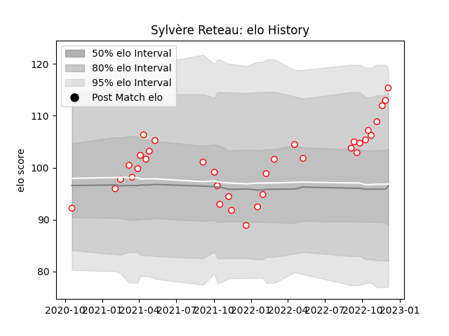

---  
layout: page  
title: Sylvère Reteau  
date: 2022-11-22 11:47:36.549760  
categories: player  
---
# Sylvère Reteau

## Positions: C, SH

## Current elo: 112.0

## Current Percentile: 85.0

# Elo History

# Match History

| Team   |   Appearances |   Win Rate |
|:-------|--------------:|-----------:|
| Dax    |            33 |   0.666667 |

| Opponent                   |   Matches |   Win Rate |
|:---------------------------|----------:|-----------:|
| Chambery                   |         5 |   0.8      |
| Aubenas                    |         3 |   0.666667 |
| Blagnac                    |         3 |   0.666667 |
| Nice                       |         3 |   0.666667 |
| Albi                       |         2 |   0.5      |
| Bourgoin-Jallieu           |         2 |   0.5      |
| Cognac Saint Jean d'Angély |         2 |   0.5      |
| Dijon                      |         2 |   1        |
| Soyaux-Angouleme           |         2 |   0.5      |
| Suresnes                   |         2 |   1        |
| Tarbes                     |         2 |   0.5      |
| US Bressane                |         2 |   0.5      |
| Massy                      |         1 |   0        |
| Rennes                     |         1 |   1        |
| Valence Romans Drome Rugby |         1 |   1        |