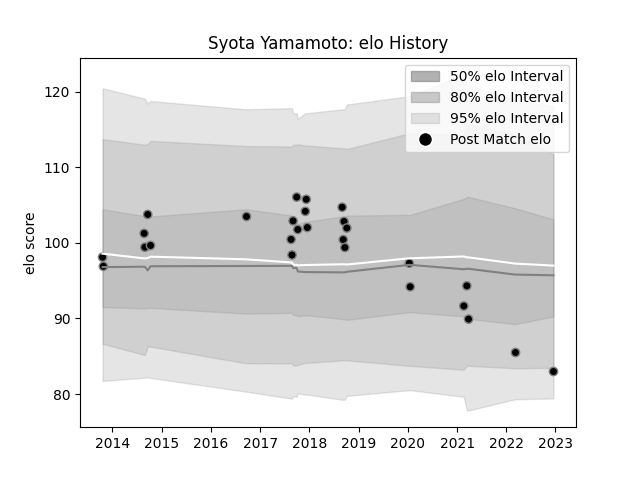

---  
layout: page  
title: Syota Yamamoto  
date: 2022-12-18 16:33:33.893097  
categories: player  
---
# Syota Yamamoto

## Positions: SH

## Current elo: 83.0

## Current Percentile: 13.0

# Elo History

# Match History

| Team             |   Appearances |   Win Rate |
|:-----------------|--------------:|-----------:|
| Black Rams Tokyo |            27 |   0.481481 |

| Opponent                          |   Matches |   Win Rate |
|:----------------------------------|----------:|-----------:|
| Yokohama Canon Eagles             |         4 |        0.5 |
| Saitama Wild Knights              |         3 |        0   |
| Coca-Cola Red Sparks              |         2 |        1   |
| Green Rockets Tokatsu             |         2 |        1   |
| Kobelco Kobe Steelers             |         2 |        0   |
| Kubota Spears Funabashi Tokyo-Bay |         2 |        0   |
| Mie Honda Heat                    |         2 |        0.5 |
| Munakata Sanix Blues              |         2 |        1   |
| NTT Docomo Red Hurricanes Osaka   |         2 |        1   |
| Mitsubishi Dynaboars              |         1 |        0   |
| Tokyo Sungoliath                  |         1 |        0   |
| Toshiba Brave Lupus Tokyo         |         1 |        0   |
| Toyota Industries Shuttles Aichi  |         1 |        1   |
| Toyota Verblitz                   |         1 |        0   |
| Urayasu D-Rocks                   |         1 |        1   |