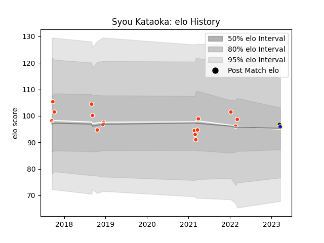

---  
layout: page  
title: Syou Kataoka  
date: 2023-03-21 18:07:57.174041  
categories: player  
---
# Syou Kataoka

Last updated: 2023-03-21
## Positions: C

## Current elo: 96.0

## Current Percentile: None

# Elo History

# Match History

| Team              |   Appearances |   Win Rate |
|:------------------|--------------:|-----------:|
| Hino Red Dolphins |            16 |     0.4375 |
| Kamaishi Seawaves |             2 |     0      |

| Opponent                         |   Matches |   Win Rate |
|:---------------------------------|----------:|-----------:|
| Munakata Sanix Blues             |         2 |        0.5 |
| NTT Docomo Red Hurricanes Osaka  |         1 |        0   |
| Toyota Industries Shuttles Aichi |         1 |        0   |
| Tokyo Sungoliath                 |         1 |        0   |
| Skyactivs Hiroshima              |         1 |        1   |
| Shizuoka Blue Revs               |         1 |        0   |
| Shimizu Blue Sharks              |         1 |        0   |
| Saitama Wild Knights             |         1 |        0   |
| Chubu Electric Power             |         1 |        1   |
| Coca-Cola Red Sparks             |         1 |        1   |
| Mitsubishi Dynaboars             |         1 |        0   |
| Mie Honda Heat                   |         1 |        0   |
| Mazda Blue Zoomers               |         1 |        1   |
| Kobelco Kobe Steelers            |         1 |        0   |
| Kamaishi Seawaves                |         1 |        1   |
| Green Rockets Tokatsu            |         1 |        1   |
| Urayasu D-Rocks                  |         1 |        0   |