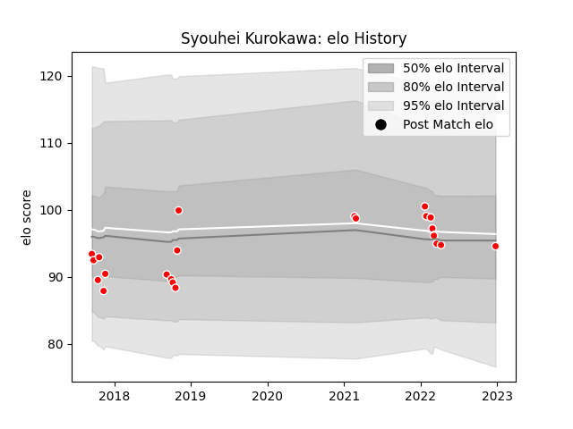

---  
layout: page  
title: Syouhei Kurokawa  
date: 2022-12-28 12:58:18.603658  
categories: player  
---
# Syouhei Kurokawa

## Positions: W

## Current elo: 95.0

## Current Percentile: 47.0

# Elo History

# Match History

| Team                  |   Appearances |   Win Rate |
|:----------------------|--------------:|-----------:|
| Chugoku Red Regulions |            22 |  0.0909091 |

| Opponent                         |   Matches |   Win Rate |
|:---------------------------------|----------:|-----------:|
| Kyuden Voltex                    |         3 |        0   |
| Toyota Industries Shuttles Aichi |         3 |        0   |
| Kamaishi Seawaves                |         2 |        0   |
| Mazda Blue Zoomers               |         2 |        0.5 |
| Mitsubishi Dynaboars             |         2 |        0   |
| Munakata Sanix Blues             |         2 |        0   |
| NTT Docomo Red Hurricanes Osaka  |         2 |        0   |
| Shimizu Blue Sharks              |         2 |        0   |
| Chubu Electric Power             |         1 |        1   |
| Coca-Cola Red Sparks             |         1 |        0   |
| Hanazono Kintetsu Liners         |         1 |        0   |
| Mie Honda Heat                   |         1 |        0   |