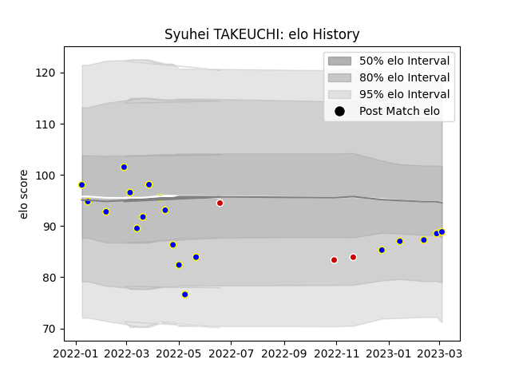

---  
layout: page  
title: Syuhei TAKEUCHI  
date: 2023-03-04 11:42:34.160712  
categories: player  
---
# Syuhei TAKEUCHI

## Positions: P

## Country: Japan

## Current elo: 89.0

## Current Percentile: 23.0

# Elo History

# Match History

| Team            |   Appearances |   Win Rate |
|:----------------|--------------:|-----------:|
| Urayasu D-Rocks |            18 |   0.444444 |
| Japan           |             3 |   0.333333 |

| Opponent                          |   Matches |   Win Rate |
|:----------------------------------|----------:|-----------:|
| Saitama Wild Knights              |         2 |        0   |
| Kobelco Kobe Steelers             |         2 |        0.5 |
| Kubota Spears Funabashi Tokyo-Bay |         2 |        0   |
| Toyota Industries Shuttles Aichi  |         2 |        1   |
| Shizuoka Blue Revs                |         1 |        0   |
| Uruguay                           |         1 |        1   |
| Toyota Verblitz                   |         1 |        0   |
| Toshiba Brave Lupus Tokyo         |         1 |        1   |
| Tokyo Sungoliath                  |         1 |        0   |
| Black Rams Tokyo                  |         1 |        1   |
| Shimizu Blue Sharks               |         1 |        1   |
| France                            |         1 |        0   |
| New Zealand                       |         1 |        0   |
| Mitsubishi Dynaboars              |         1 |        0   |
| Kamaishi Seawaves                 |         1 |        1   |
| Green Rockets Tokatsu             |         1 |        1   |
| Yokohama Canon Eagles             |         1 |        0   |