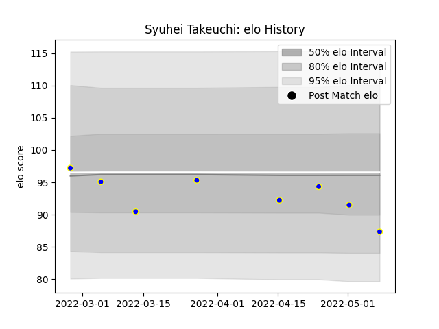

---  
layout: page  
title: Syuhei Takeuchi  
date: 2022-11-22 11:33:02.015186  
categories: player  
---
# Syuhei Takeuchi

## Positions: P

## Current elo: 87.0

## Current Percentile: 30.0

# Elo History

# Match History

| Team            |   Appearances |   Win Rate |
|:----------------|--------------:|-----------:|
| Urayasu D-Rocks |             8 |      0.375 |

| Opponent                          |   Matches |   Win Rate |
|:----------------------------------|----------:|-----------:|
| Black Rams Tokyo                  |         1 |          1 |
| Green Rockets Tokatsu             |         1 |          1 |
| Kobelco Kobe Steelers             |         1 |          0 |
| Kubota Spears Funabashi Tokyo-Bay |         1 |          0 |
| Shizuoka Blue Revs                |         1 |          0 |
| Toshiba Brave Lupus Tokyo         |         1 |          1 |
| Toyota Verblitz                   |         1 |          0 |
| Yokohama Canon Eagles             |         1 |          0 |