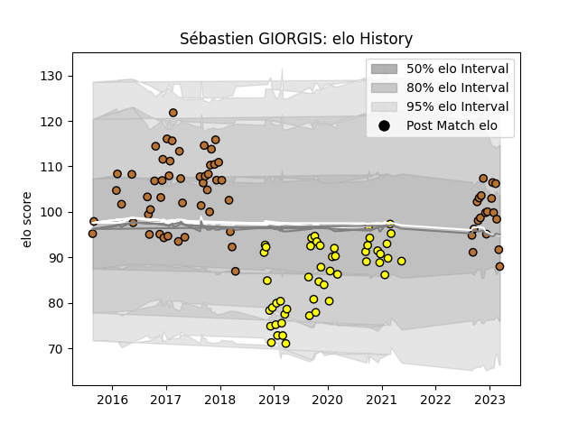

---  
layout: page  
title: Sébastien GIORGIS  
date: 2023-03-29 11:28:04.305985  
categories: player  
---
# Sébastien GIORGIS

Last updated: 2023-03-29
## Positions: W, C

## Current elo: 87.0

## Current Percentile: 44.0

# Elo History

# Match History

| Team        |   Appearances |   Win Rate |
|:------------|--------------:|-----------:|
| Narbonne    |            67 |   0.440299 |
| Carcassonne |            49 |   0.428571 |

| Opponent                   |   Matches |   Win Rate |
|:---------------------------|----------:|-----------:|
| Mont-de-Marsan             |         9 |  0.444444  |
| Biarritz Olympique         |         8 |  0.375     |
| Perpignan                  |         8 |  0.125     |
| Oyonnax                    |         7 |  0.285714  |
| Vannes                     |         6 |  0.666667  |
| Colomiers                  |         6 |  0.0833333 |
| Aurillac                   |         6 |  0.5       |
| Soyaux-Angouleme           |         5 |  0.6       |
| Beziers                    |         5 |  0.2       |
| Nevers                     |         5 |  0.4       |
| Montauban                  |         4 |  0.5       |
| Albi                       |         4 |  0.375     |
| Bourgoin-Jallieu           |         4 |  0.5       |
| Massy                      |         3 |  0.666667  |
| Provence Rugby             |         3 |  0.666667  |
| Valence Romans Drome Rugby |         3 |  0         |
| Tarbes                     |         3 |  0.333333  |
| Carcassonne                |         3 |  0.666667  |
| Bayonne                    |         3 |  0.333333  |
| Dax                        |         3 |  0.666667  |
| US Bressane                |         2 |  0.5       |
| Suresnes                   |         2 |  1         |
| Rouen                      |         2 |  0.5       |
| Cognac Saint Jean d'Angély |         2 |  1         |
| Chambery                   |         2 |  0         |
| Grenoble                   |         2 |  0         |
| Nice                       |         1 |  1         |
| Roval Drome XV             |         1 |  1         |
| Brive                      |         1 |  1         |
| Carqueiranne-Hyères        |         1 |  1         |
| Lyon                       |         1 |  1         |
| Blagnac                    |         1 |  0.5       |