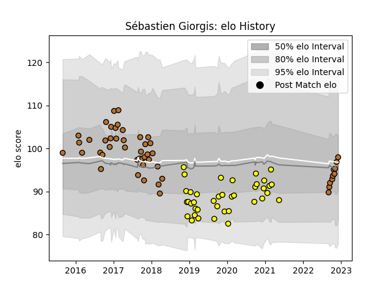

---  
layout: page  
title: Sébastien Giorgis  
date: 2022-12-14 11:34:03.278347  
categories: player  
---
# Sébastien Giorgis

## Positions: W, C

## Current elo: 97.0

## Current Percentile: 59.0

# Elo History

# Match History

| Team        |   Appearances |   Win Rate |
|:------------|--------------:|-----------:|
| Narbonne    |            51 |   0.421569 |
| Carcassonne |            39 |   0.435897 |

| Opponent                   |   Matches |   Win Rate |
|:---------------------------|----------:|-----------:|
| Biarritz Olympique         |         8 |   0.375    |
| Mont-de-Marsan             |         8 |   0.5      |
| Aurillac                   |         6 |   0.5      |
| Perpignan                  |         6 |   0        |
| Oyonnax                    |         6 |   0.333333 |
| Beziers                    |         5 |   0.2      |
| Colomiers                  |         5 |   0.1      |
| Vannes                     |         4 |   1        |
| Soyaux-Angouleme           |         4 |   0.5      |
| Nevers                     |         4 |   0.25     |
| Bayonne                    |         3 |   0.333333 |
| Bourgoin-Jallieu           |         3 |   0.333333 |
| Valence Romans Drome Rugby |         2 |   0        |
| Tarbes                     |         2 |   0.5      |
| Montauban                  |         2 |   0        |
| Albi                       |         2 |   0.75     |
| Grenoble                   |         2 |   0        |
| Dax                        |         2 |   0.5      |
| Carcassonne                |         2 |   0.5      |
| Massy                      |         2 |   0.5      |
| Lyon                       |         1 |   1        |
| Cognac Saint Jean d'Angély |         1 |   1        |
| Nice                       |         1 |   1        |
| Chambery                   |         1 |   0        |
| Carqueiranne-Hyères        |         1 |   1        |
| Provence Rugby             |         1 |   1        |
| Rouen                      |         1 |   1        |
| Roval Drome XV             |         1 |   1        |
| Suresnes                   |         1 |   1        |
| Brive                      |         1 |   1        |
| US Bressane                |         1 |   1        |
| Blagnac                    |         1 |   0.5      |