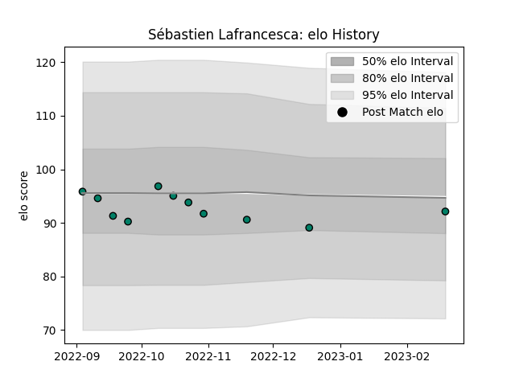

---  
layout: page  
title: Sébastien Lafrancesca  
date: 2022-11-22 11:30:34.443808  
categories: player  
---
# Sébastien Lafrancesca

## Positions: P

## Current elo: 95.0

## Current Percentile: 50.0

# Elo History

# Match History

| Team     |   Appearances |   Win Rate |
|:---------|--------------:|-----------:|
| Suresnes |             9 |   0.444444 |

| Opponent                   |   Matches |   Win Rate |
|:---------------------------|----------:|-----------:|
| Albi                       |         1 |          1 |
| Bourgoin-Jallieu           |         1 |          1 |
| Carqueiranne-Hyères        |         1 |          1 |
| Dax                        |         1 |          0 |
| Narbonne                   |         1 |          0 |
| Nice                       |         1 |          0 |
| Rennes                     |         1 |          1 |
| US Bressane                |         1 |          0 |
| Valence Romans Drome Rugby |         1 |          0 |