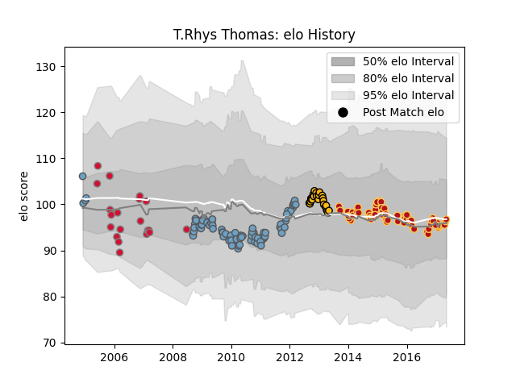

---  
layout: page  
title: T.Rhys Thomas  
date: 2023-02-02 19:11:43.719796  
categories: player  
---
# T.Rhys Thomas

## Positions: H

## Country: Wales

## Current elo: 97.0

## Current Percentile: 50.0

# Elo History

# Match History

| Team          |   Appearances |   Win Rate |
|:--------------|--------------:|-----------:|
| Cardiff Blues |            95 |   0.642105 |
| Dragons       |            73 |   0.39726  |
| Wasps         |            29 |   0.465517 |
| Wales         |            20 |   0.425    |

| Opponent                 |   Matches |   Win Rate |
|:-------------------------|----------:|-----------:|
| Edinburgh                |        19 |   0.421053 |
| Ulster                   |        13 |   0.615385 |
| Scarlets                 |        12 |   0.416667 |
| Connacht                 |        11 |   0.545455 |
| Ospreys                  |        10 |   0.2      |
| Leinster                 |         9 |   0.388889 |
| Glasgow Warriors         |         9 |   0.444444 |
| Munster                  |         9 |   0.333333 |
| Gloucester Rugby         |         9 |   0.444444 |
| Cardiff Blues            |         8 |   0.375    |
| Dragons                  |         8 |   0.875    |
| Benetton Treviso         |         8 |   0.75     |
| Harlequins               |         6 |   0.666667 |
| Sale Sharks              |         6 |   0.5      |
| London Irish             |         5 |   0.6      |
| Northampton Saints       |         4 |   0.25     |
| Leicester Tigers         |         4 |   0.625    |
| Zebre                    |         4 |   0.75     |
| Aironi                   |         3 |   1        |
| Castres Olympique        |         3 |   0.666667 |
| Stade Francais Paris     |         3 |   0.666667 |
| Stade Toulousain         |         3 |   0.666667 |
| Bath Rugby               |         3 |   0.333333 |
| London Welsh             |         3 |   1        |
| Newcastle Falcons        |         3 |   0        |
| New Zealand              |         2 |   0        |
| Bayonne                  |         2 |   0.75     |
| Saracens                 |         2 |   0        |
| Biarritz Olympique       |         2 |   1        |
| France                   |         2 |   0        |
| Bucuresti                |         2 |   1        |
| South Africa             |         2 |   0        |
| Calvisano                |         2 |   1        |
| Worcester Warriors       |         2 |   0.5      |
| Canada                   |         2 |   1        |
| Italy                    |         2 |   0.25     |
| Ireland                  |         2 |   0        |
| England                  |         2 |   0.5      |
| Exeter Chiefs            |         2 |   0        |
| Scotland                 |         2 |   0.5      |
| Wasps                    |         1 |   1        |
| United States of America |         1 |   1        |
| Toulon                   |         1 |   1        |
| Fiji                     |         1 |   1        |
| Racing 92                |         1 |   1        |
| RC Enisei                |         1 |   1        |
| Pau                      |         1 |   1        |
| Bordeaux Begles          |         1 |   0        |
| Brive                    |         1 |   0        |
| Mogliano                 |         1 |   1        |
| Australia                |         1 |   1        |
| Pacific Islands          |         1 |   1        |