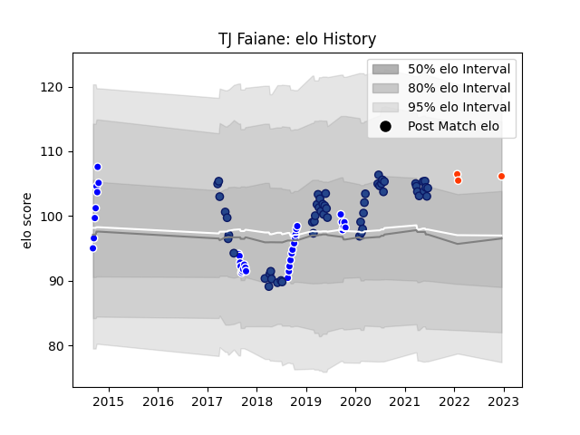

---  
layout: page  
title: TJ Faiane  
date: 2023-01-15 12:03:28.261244  
categories: player  
---
# TJ Faiane

## Positions: C

## Country: Blues

## Current elo: 111.0

## Current Percentile: 78.0

# Elo History

# Match History

| Team              |   Appearances |   Win Rate |
|:------------------|--------------:|-----------:|
| Blues             |            55 |   0.545455 |
| Auckland          |            35 |   0.628571 |
| Hino Red Dolphins |             5 |   0.4      |

| Opponent                         |   Matches |   Win Rate |
|:---------------------------------|----------:|-----------:|
| Chiefs                           |         9 |   0.388889 |
| Highlanders                      |         7 |   0.571429 |
| Hurricanes                       |         6 |   0.5      |
| Crusaders                        |         6 |   0        |
| Taranaki                         |         5 |   0.4      |
| Counties Manukau                 |         4 |   0.5      |
| Wellington                       |         4 |   0.75     |
| Queensland Reds                  |         4 |   0.75     |
| Tasman                           |         4 |   0.25     |
| Canterbury                       |         3 |   0.666667 |
| Waikato                          |         3 |   0.666667 |
| Bulls                            |         3 |   0.833333 |
| North Harbour                    |         3 |   0.666667 |
| Sunwolves                        |         3 |   0.666667 |
| Northland                        |         3 |   1        |
| Southland                        |         3 |   1        |
| New South Wales Waratahs         |         3 |   1        |
| Bay of Plenty                    |         2 |   1        |
| Stormers                         |         2 |   1        |
| Sharks                           |         2 |   0        |
| Mie Honda Heat                   |         2 |   0        |
| Melbourne Rebels                 |         2 |   0.5      |
| Kamaishi Seawaves                |         2 |   1        |
| Brumbies                         |         2 |   0.5      |
| Western Force                    |         2 |   1        |
| Otago                            |         1 |   0        |
| British and Irish Lions          |         1 |   1        |
| Lions                            |         1 |   1        |
| Jaguares                         |         1 |   0        |
| Toyota Industries Shuttles Aichi |         1 |   0        |
| Cheetahs                         |         1 |   1        |