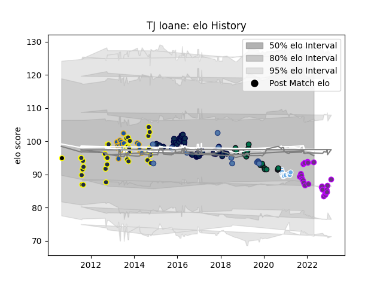

---  
layout: page  
title: TJ Ioane  
date: 2022-11-22 11:38:55.652934  
categories: player  
---
# TJ Ioane

## Positions: FL, N8

## Country: Samoa

## Current elo: 76.0

## Current Percentile: 3.0

# Elo History

# Match History

| Team             |   Appearances |   Win Rate |
|:-----------------|--------------:|-----------:|
| Sale Sharks      |            53 |   0.433962 |
| Otago            |            28 |   0.464286 |
| London Irish     |            20 |   0.575    |
| Highlanders      |            18 |   0.388889 |
| US Bressane      |            15 |   0.566667 |
| Glasgow Warriors |            11 |   0.272727 |
| Samoa            |            11 |   0.227273 |
| Wellington       |             1 |   1        |

| Opponent                   |   Matches |   Win Rate |
|:---------------------------|----------:|-----------:|
| Harlequins                 |         9 |  0.555556  |
| Newcastle Falcons          |         8 |  0.4375    |
| Saracens                   |         7 |  0.0714286 |
| Northampton Saints         |         6 |  0.333333  |
| Wasps                      |         5 |  0.4       |
| Blues                      |         4 |  0.5       |
| Southland                  |         4 |  0.5       |
| Manawatu                   |         4 |  0.75      |
| London Irish               |         4 |  1         |
| Waikato                    |         3 |  1         |
| Canterbury                 |         3 |  0         |
| Worcester Warriors         |         3 |  1         |
| Hawke's Bay                |         3 |  0         |
| Hurricanes                 |         3 |  0.666667  |
| Bath Rugby                 |         3 |  0.333333  |
| Leicester Tigers           |         3 |  0.666667  |
| Northland                  |         3 |  0.666667  |
| Exeter Chiefs              |         3 |  0         |
| Bristol Rugby              |         3 |  0.166667  |
| Melbourne Rebels           |         2 |  0.5       |
| Japan                      |         2 |  0         |
| Ospreys                    |         2 |  0.5       |
| Montauban                  |         2 |  0.25      |
| North Harbour              |         2 |  1         |
| Gloucester Rugby           |         2 |  0         |
| Leinster                   |         2 |  0         |
| Scarlets                   |         2 |  0.5       |
| Cardiff Blues              |         2 |  0.5       |
| Bay of Plenty              |         2 |  0.5       |
| Bedford                    |         2 |  1         |
| Crusaders                  |         2 |  0         |
| Scotland                   |         2 |  0         |
| Ulster                     |         2 |  0         |
| Counties Manukau           |         2 |  0         |
| Tasman                     |         2 |  0.5       |
| Richmond                   |         1 |  1         |
| Western Force              |         1 |  0         |
| Toulon                     |         1 |  0         |
| Suresnes                   |         1 |  1         |
| Southern Kings             |         1 |  0         |
| Nottingham                 |         1 |  1         |
| Rennes                     |         1 |  1         |
| South Africa               |         1 |  0         |
| Sharks                     |         1 |  1         |
| Oyonnax                    |         1 |  0         |
| Pau                        |         1 |  1         |
| Russia                     |         1 |  1         |
| Queensland Reds            |         1 |  0         |
| Nice                       |         1 |  1         |
| Agen                       |         1 |  1         |
| Nevers                     |         1 |  0         |
| Coventry                   |         1 |  1         |
| Aurillac                   |         1 |  0         |
| Australia                  |         1 |  0         |
| Bayonne                    |         1 |  0         |
| Benetton Treviso           |         1 |  1         |
| Bourgoin-Jallieu           |         1 |  1         |
| Brumbies                   |         1 |  0         |
| Bulls                      |         1 |  0         |
| Canada                     |         1 |  1         |
| Carcassonne                |         1 |  0         |
| Chambery                   |         1 |  1         |
| Cognac Saint Jean d'Angély |         1 |  1         |
| Cornish Pirates            |         1 |  1         |
| Dax                        |         1 |  0         |
| Narbonne                   |         1 |  1         |
| Doncaster                  |         1 |  1         |
| Dragons                    |         1 |  0         |
| Ealing Trailfinders        |         1 |  1         |
| Edinburgh                  |         1 |  0         |
| England                    |         1 |  0         |
| Georgia                    |         1 |  0.5       |
| Hartpury College           |         1 |  1         |
| Ireland                    |         1 |  0         |
| Auckland                   |         1 |  0         |
| Lions                      |         1 |  1         |
| Montpellier Herault        |         1 |  0         |
| Munster                    |         1 |  0         |
| Yorkshire Carnegie         |         1 |  0         |