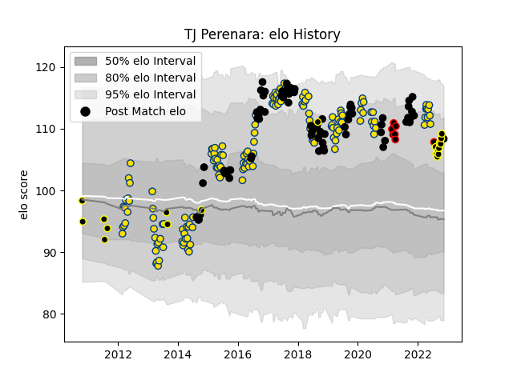

---  
layout: page  
title: TJ Perenara  
date: 2022-11-16 11:39:30.588694  
categories: player  
---
# TJ Perenara

## Positions: SH

## Country: New Zealand

## Current elo: 108.0

## Current Percentile: 86.0

# Elo History

# Match History

| Team                            |   Appearances |   Win Rate |
|:--------------------------------|--------------:|-----------:|
| Hurricanes                      |           151 |   0.645695 |
| New Zealand                     |            74 |   0.824324 |
| Wellington                      |            22 |   0.818182 |
| NTT Docomo Red Hurricanes Osaka |             6 |   0.5      |
| New Zealand Maori               |             1 |   0        |

| Opponent                 |   Matches |   Win Rate |
|:-------------------------|----------:|-----------:|
| Australia                |        19 |   0.736842 |
| Chiefs                   |        19 |   0.5      |
| Highlanders              |        18 |   0.611111 |
| Blues                    |        18 |   0.722222 |
| Crusaders                |        17 |   0.470588 |
| Argentina                |        13 |   1        |
| South Africa             |        11 |   0.772727 |
| Brumbies                 |        11 |   0.363636 |
| Sharks                   |         7 |   0.714286 |
| Queensland Reds          |         7 |   0.857143 |
| New South Wales Waratahs |         7 |   0.714286 |
| Melbourne Rebels         |         7 |   1        |
| Western Force            |         6 |   0.833333 |
| Stormers                 |         6 |   0.333333 |
| Ireland                  |         6 |   0.333333 |
| Lions                    |         6 |   0.833333 |
| Bulls                    |         6 |   0.666667 |
| France                   |         5 |   1        |
| Wales                    |         4 |   1        |
| Jaguares                 |         4 |   0.75     |
| Cheetahs                 |         4 |   0.75     |
| Southland                |         3 |   1        |
| British and Irish Lions  |         3 |   0.5      |
| Scotland                 |         3 |   1        |
| Sunwolves                |         3 |   1        |
| North Harbour            |         3 |   1        |
| Canterbury               |         3 |   0.333333 |
| Namibia                  |         2 |   1        |
| Taranaki                 |         2 |   1        |
| Southern Kings           |         2 |   1        |
| Moana Pasifika           |         2 |   0.5      |
| Auckland                 |         2 |   0.5      |
| United States of America |         2 |   1        |
| Counties Manukau         |         2 |   1        |
| England                  |         2 |   0.5      |
| Hawke's Bay              |         2 |   1        |
| Tonga                    |         1 |   1        |
| Tasman                   |         1 |   1        |
| Waikato                  |         1 |   1        |
| Black Rams Tokyo         |         1 |   1        |
| Bay of Plenty            |         1 |   1        |
| Fijian Drua              |         1 |   1        |
| Canada                   |         1 |   1        |
| Shizuoka Blue Revs       |         1 |   0        |
| Samoa                    |         1 |   1        |
| Saitama Wild Knights     |         1 |   0        |
| Otago                    |         1 |   1        |
| Northland                |         1 |   0        |
| Kobelco Kobe Steelers    |         1 |   0        |
| Italy                    |         1 |   1        |
| Hino Red Dolphins        |         1 |   1        |
| Georgia                  |         1 |   1        |
| Yokohama Canon Eagles    |         1 |   1        |