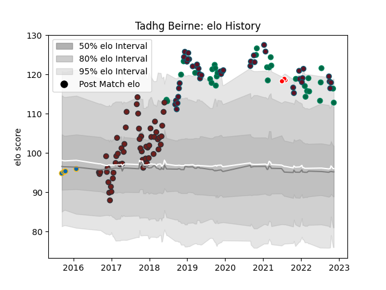

---  
layout: page  
title: Tadhg Beirne  
date: 2023-02-02 18:53:21.859736  
categories: player  
---
# Tadhg Beirne

## Positions: L, FL

## Country: Ireland

## Current elo: 94.0

## Current Percentile: 91.0

# Elo History

# Match History

| Team                    |   Appearances |   Win Rate |
|:------------------------|--------------:|-----------:|
| Scarlets                |            54 |   0.666667 |
| Munster                 |            49 |   0.673469 |
| Ireland                 |            33 |   0.727273 |
| Leinster                |             4 |   0.5      |
| British and Irish Lions |             3 |   0.666667 |

| Opponent                 |   Matches |   Win Rate |
|:-------------------------|----------:|-----------:|
| Leinster                 |        13 |   0.269231 |
| Connacht                 |         9 |   0.888889 |
| Ospreys                  |         8 |   0.75     |
| Edinburgh                |         7 |   0.857143 |
| Benetton Treviso         |         6 |   0.833333 |
| Cardiff Blues            |         6 |   0.833333 |
| Dragons                  |         6 |   0.5      |
| Italy                    |         5 |   1        |
| Ulster                   |         5 |   0.6      |
| New Zealand              |         5 |   0.6      |
| Munster                  |         4 |   0.5      |
| Wales                    |         4 |   0.5      |
| Toulon                   |         4 |   0.5      |
| Saracens                 |         4 |   0.375    |
| Zebre                    |         4 |   1        |
| Castres Olympique        |         4 |   0.75     |
| Glasgow Warriors         |         4 |   0.75     |
| Australia                |         3 |   1        |
| Japan                    |         3 |   0.666667 |
| France                   |         3 |   0        |
| Bath Rugby               |         3 |   0.666667 |
| South Africa             |         3 |   0.666667 |
| Scotland                 |         3 |   1        |
| England                  |         3 |   0.666667 |
| Scarlets                 |         2 |   0.5      |
| Wasps                    |         2 |   1        |
| Cheetahs                 |         2 |   0.5      |
| Stade Toulousain         |         2 |   0        |
| Southern Kings           |         2 |   1        |
| Gloucester Rugby         |         2 |   1        |
| Exeter Chiefs            |         2 |   0.75     |
| Northampton Saints       |         2 |   1        |
| Sale Sharks              |         1 |   0        |
| Russia                   |         1 |   1        |
| Racing 92                |         1 |   0.5      |
| Fiji                     |         1 |   1        |
| United States of America |         1 |   1        |
| Bulls                    |         1 |   1        |
| La Rochelle              |         1 |   1        |
| Samoa                    |         1 |   1        |