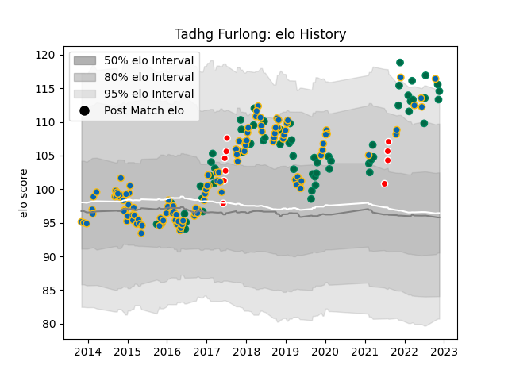

---  
layout: page  
title: Tadhg Furlong  
date: 2022-12-09 13:24:22.611533  
categories: player  
---
# Tadhg Furlong

## Positions: P

## Country: Ireland

## Current elo: 112.0

## Current Percentile: 92.0

# Elo History

# Match History

| Team                    |   Appearances |   Win Rate |
|:------------------------|--------------:|-----------:|
| Leinster                |           118 |   0.75     |
| Ireland                 |            61 |   0.713115 |
| British and Irish Lions |            10 |   0.65     |

| Opponent            |   Matches |   Win Rate |
|:--------------------|----------:|-----------:|
| Munster             |        12 |   0.666667 |
| New Zealand         |        11 |   0.590909 |
| Glasgow Warriors    |        11 |   0.590909 |
| Ulster              |        11 |   0.636364 |
| Scarlets            |         8 |   0.625    |
| Wales               |         8 |   0.5625   |
| South Africa        |         8 |   0.5      |
| Scotland            |         7 |   0.857143 |
| England             |         7 |   0.571429 |
| Edinburgh           |         7 |   0.857143 |
| Connacht            |         7 |   0.571429 |
| Benetton Treviso    |         7 |   0.928571 |
| France              |         6 |   0.5      |
| Wasps               |         6 |   0.75     |
| Ospreys             |         6 |   0.916667 |
| Zebre               |         6 |   1        |
| Dragons             |         5 |   0.6      |
| Italy               |         5 |   1        |
| Australia           |         5 |   0.8      |
| Castres Olympique   |         4 |   0.875    |
| Cardiff Blues       |         4 |   1        |
| Northampton Saints  |         4 |   1        |
| Stade Toulousain    |         3 |   0.666667 |
| Argentina           |         3 |   1        |
| Montpellier Herault |         3 |   1        |
| Japan               |         3 |   0.666667 |
| Bath Rugby          |         3 |   1        |
| Saracens            |         2 |   0.5      |
| Exeter Chiefs       |         2 |   1        |
| Fiji                |         2 |   1        |
| Harlequins          |         2 |   0.5      |
| Lyon                |         2 |   1        |
| Samoa               |         1 |   1        |
| Russia              |         1 |   1        |
| Romania             |         1 |   1        |
| Racing 92           |         1 |   1        |
| Crusaders           |         1 |   1        |
| Clermont Auvergne   |         1 |   0        |
| Bulls               |         1 |   0        |
| Provincial Union XV |         1 |   1        |
| New Zealand Maori   |         1 |   1        |