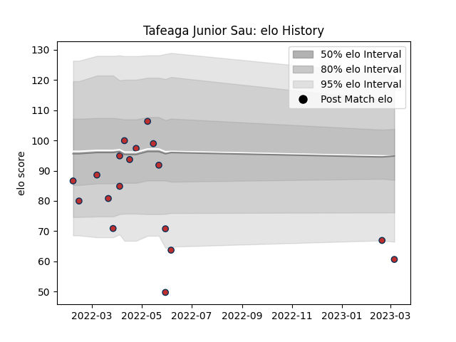

---  
layout: page  
title: Tafeaga Junior Sau  
date: 2023-03-09 10:11:43.219449  
categories: player  
---
# Tafeaga Junior Sau

## Positions: C, W

## Current elo: 61.0

## Current Percentile: 5.0

# Elo History

# Match History

| Team         |   Appearances |   Win Rate |
|:-------------|--------------:|-----------:|
| Old Glory DC |            18 |   0.222222 |

| Opponent               |   Matches |   Win Rate |
|:-----------------------|----------:|-----------:|
| Rugby New York         |         3 |        0   |
| NOLA Gold              |         2 |        0   |
| R.U. New York          |         2 |        0   |
| Rugby ATL              |         2 |        0   |
| Toronto Arrows         |         2 |        0.5 |
| Austin Gilgronis       |         1 |        0   |
| Chicago Hounds         |         1 |        1   |
| Dallas Jackals         |         1 |        1   |
| Houston SaberCats      |         1 |        0   |
| New England Free Jacks |         1 |        0   |
| San Diego Legion       |         1 |        0   |
| Utah Warriors          |         1 |        1   |