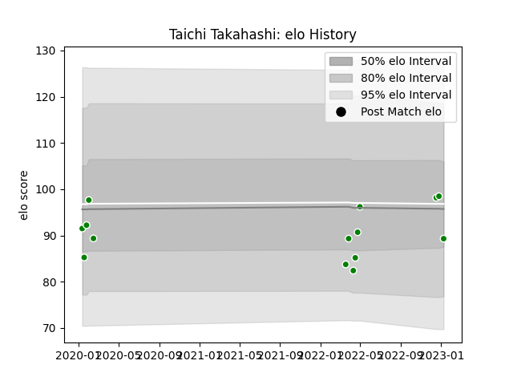

---  
layout: page  
title: Taichi Takahashi  
date: 2023-03-17 16:59:56.299257  
categories: player  
---
# Taichi Takahashi

## Positions: W

## Current elo: 91.0

## Current Percentile: 21.0

# Elo History

# Match History

| Team            |   Appearances |   Win Rate |
|:----------------|--------------:|-----------:|
| Toyota Verblitz |            30 |   0.566667 |

| Opponent                          |   Matches |   Win Rate |
|:----------------------------------|----------:|-----------:|
| Saitama Wild Knights              |         3 |   0        |
| Shizuoka Blue Revs                |         3 |   0.666667 |
| Tokyo Sungoliath                  |         3 |   0.333333 |
| Toshiba Brave Lupus Tokyo         |         3 |   0.333333 |
| Black Rams Tokyo                  |         2 |   0.5      |
| Green Rockets Tokatsu             |         2 |   1        |
| Hino Red Dolphins                 |         2 |   1        |
| Kubota Spears Funabashi Tokyo-Bay |         2 |   0.5      |
| Mie Honda Heat                    |         2 |   1        |
| NTT Docomo Red Hurricanes Osaka   |         2 |   1        |
| Yokohama Canon Eagles             |         2 |   0        |
| Hanazono Kintetsu Liners          |         1 |   1        |
| Kobelco Kobe Steelers             |         1 |   1        |
| Mitsubishi Dynaboars              |         1 |   0        |
| Urayasu D-Rocks                   |         1 |   1        |