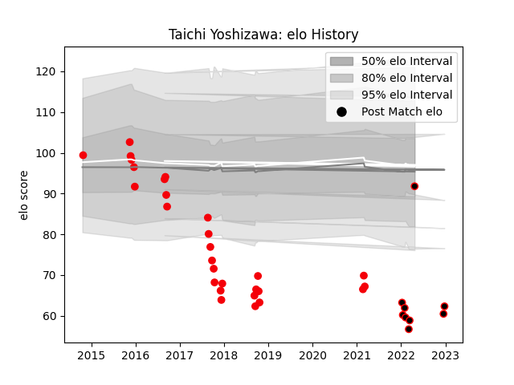

---  
layout: page  
title: Taichi Yoshizawa  
date: 2022-12-28 12:53:10.418572  
categories: player  
---
# Taichi Yoshizawa

## Positions: FB, W

## Current elo: 92.0

## Current Percentile: 0.0

# Elo History

# Match History

| Team                            |   Appearances |   Win Rate |
|:--------------------------------|--------------:|-----------:|
| Coca-Cola Red Sparks            |            28 |  0.0714286 |
| NTT Docomo Red Hurricanes Osaka |             9 |  0.222222  |

| Opponent                          |   Matches |   Win Rate |
|:----------------------------------|----------:|-----------:|
| Yokohama Canon Eagles             |         4 |          0 |
| Toshiba Brave Lupus Tokyo         |         4 |          0 |
| Saitama Wild Knights              |         3 |          0 |
| Toyota Industries Shuttles Aichi  |         3 |          0 |
| Black Rams Tokyo                  |         3 |          0 |
| Kubota Spears Funabashi Tokyo-Bay |         2 |          0 |
| Kyuden Voltex                     |         2 |          1 |
| Chugoku Red Regulions             |         2 |          1 |
| Shizuoka Blue Revs                |         2 |          0 |
| Hanazono Kintetsu Liners          |         2 |          0 |
| Green Rockets Tokatsu             |         2 |          0 |
| Toyota Verblitz                   |         2 |          0 |
| Munakata Sanix Blues              |         2 |          0 |
| Mie Honda Heat                    |         1 |          0 |
| NTT Docomo Red Hurricanes Osaka   |         1 |          0 |
| Kobelco Kobe Steelers             |         1 |          0 |
| Tokyo Sungoliath                  |         1 |          0 |