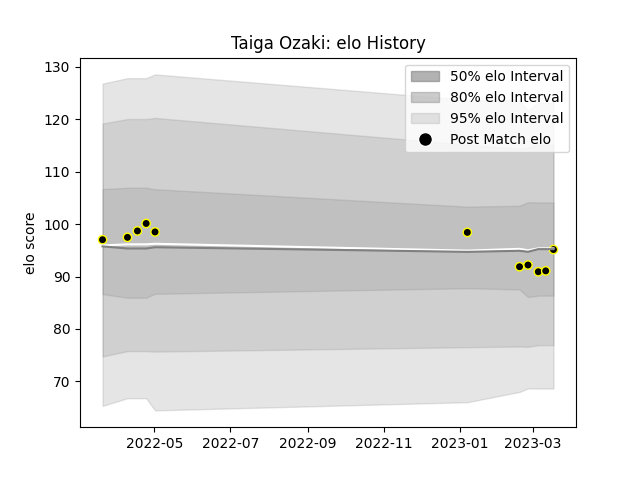

---  
layout: page  
title: Taiga Ozaki  
date: 2023-03-21 18:09:56.738598  
categories: player  
---
# Taiga Ozaki

Last updated: 2023-03-21
## Positions: W, C

## Current elo: 95.0

## Current Percentile: 39.0

# Elo History

# Match History

| Team             |   Appearances |   Win Rate |
|:-----------------|--------------:|-----------:|
| Tokyo Sungoliath |            11 |   0.727273 |

| Opponent                        |   Matches |   Win Rate |
|:--------------------------------|----------:|-----------:|
| Black Rams Tokyo                |         2 |          1 |
| Shizuoka Blue Revs              |         2 |          1 |
| Hanazono Kintetsu Liners        |         1 |          1 |
| NTT Docomo Red Hurricanes Osaka |         1 |          1 |
| Saitama Wild Knights            |         1 |          0 |
| Toshiba Brave Lupus Tokyo       |         1 |          0 |
| Toyota Verblitz                 |         1 |          0 |
| Urayasu D-Rocks                 |         1 |          1 |
| Yokohama Canon Eagles           |         1 |          1 |