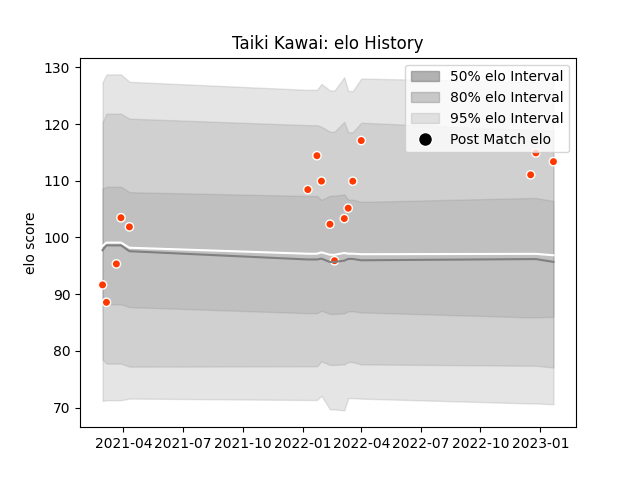

---  
layout: page  
title: Taiki Kawai  
date: 2023-01-21 15:40:25.018239  
categories: player  
---
# Taiki Kawai

## Positions: C, W

## Current elo: 113.0

## Current Percentile: 86.0

# Elo History

# Match History

| Team              |   Appearances |   Win Rate |
|:------------------|--------------:|-----------:|
| Hino Red Dolphins |            17 |   0.294118 |

| Opponent                         |   Matches |   Win Rate |
|:---------------------------------|----------:|-----------:|
| Kamaishi Seawaves                |         3 |          1 |
| Hanazono Kintetsu Liners         |         2 |          0 |
| Mie Honda Heat                   |         2 |          0 |
| Mitsubishi Dynaboars             |         2 |          0 |
| Black Rams Tokyo                 |         1 |          0 |
| Green Rockets Tokatsu            |         1 |          1 |
| Kobelco Kobe Steelers            |         1 |          0 |
| NTT Docomo Red Hurricanes Osaka  |         1 |          0 |
| Saitama Wild Knights             |         1 |          0 |
| Skyactivs Hiroshima              |         1 |          1 |
| Toyota Industries Shuttles Aichi |         1 |          0 |
| Urayasu D-Rocks                  |         1 |          0 |