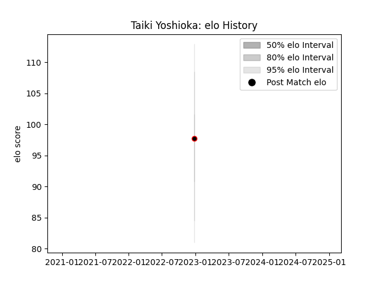

---  
layout: page  
title: Taiki Yoshioka  
date: 2023-03-21 18:16:03.367016  
categories: player  
---
# Taiki Yoshioka

Last updated: 2023-03-21
## Positions: P

## Current elo: 106.0

## Current Percentile: 66.0

# Elo History

# Match History

| Team           |   Appearances |   Win Rate |
|:---------------|--------------:|-----------:|
| Mie Honda Heat |             7 |   0.857143 |

| Opponent                         |   Matches |   Win Rate |
|:---------------------------------|----------:|-----------:|
| Kamaishi Seawaves                |         2 |          1 |
| Toyota Industries Shuttles Aichi |         2 |          1 |
| Green Rockets Tokatsu            |         1 |          0 |
| Hino Red Dolphins                |         1 |          1 |
| Shimizu Blue Sharks              |         1 |          1 |