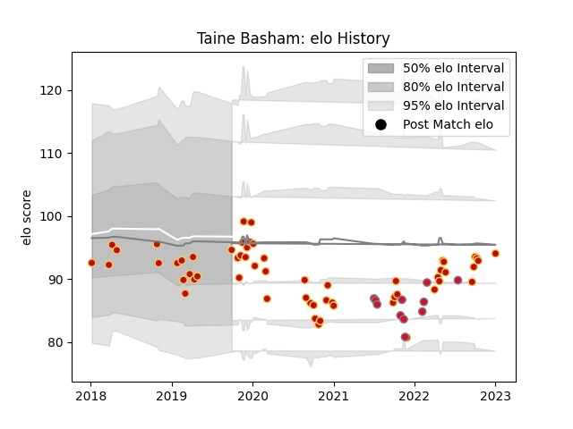

---  
layout: page  
title: Taine Basham  
date: 2023-01-06 00:12:58.370335  
categories: player  
---
# Taine Basham

## Positions: FL, N8

## Country: Wales

## Current elo: 103.0

## Current Percentile: 27.0

# Elo History

# Match History

| Team    |   Appearances |   Win Rate |
|:--------|--------------:|-----------:|
| Dragons |            58 |   0.241379 |
| Wales   |            11 |   0.409091 |

| Opponent           |   Matches |   Win Rate |
|:-------------------|----------:|-----------:|
| Scarlets           |         9 |   0.333333 |
| Benetton Treviso   |         5 |   0.2      |
| Ospreys            |         5 |   0.3      |
| Edinburgh          |         4 |   0        |
| Cardiff Blues      |         4 |   0        |
| Munster            |         4 |   0.25     |
| Leinster           |         3 |   0        |
| Ulster             |         3 |   0        |
| Glasgow Warriors   |         3 |   0.666667 |
| Zebre              |         3 |   0.333333 |
| Cheetahs           |         3 |   0.333333 |
| Argentina          |         2 |   0.25     |
| Connacht           |         2 |   0.5      |
| Castres Olympique  |         2 |   0.5      |
| South Africa       |         2 |   0        |
| Sharks             |         2 |   0        |
| Scotland           |         1 |   1        |
| Worcester Warriors |         1 |   0        |
| Bristol Rugby      |         1 |   0        |
| Stormers           |         1 |   0        |
| Southern Kings     |         1 |   0.5      |
| England            |         1 |   0        |
| Canada             |         1 |   1        |
| Fiji               |         1 |   1        |
| New Zealand        |         1 |   0        |
| Lions              |         1 |   0        |
| Australia          |         1 |   1        |
| Ireland            |         1 |   0        |
| RC Enisei          |         1 |   1        |