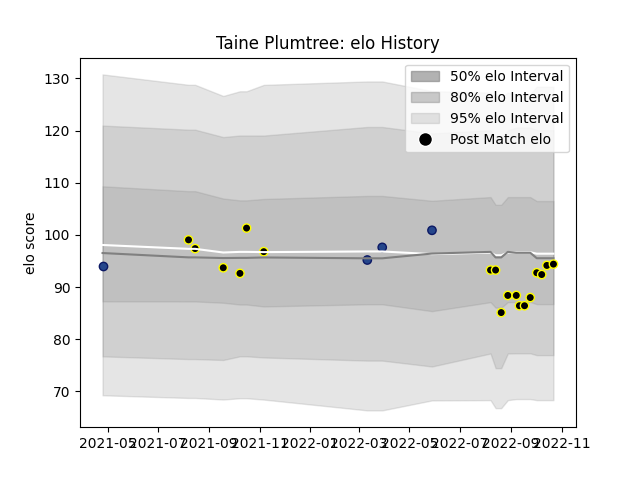

---  
layout: page  
title: Taine Plumtree  
date: 2023-03-21 18:44:57.922200  
categories: player  
---
# Taine Plumtree

Last updated: 2023-03-21
## Positions: FL

## Current elo: 94.0

## Current Percentile: 42.0

# Elo History

# Match History

| Team       |   Appearances |   Win Rate |
|:-----------|--------------:|-----------:|
| Wellington |            18 |   0.722222 |
| Blues      |             4 |   0.75     |

| Opponent                 |   Matches |   Win Rate |
|:-------------------------|----------:|-----------:|
| Canterbury               |         3 |   0.666667 |
| Hawke's Bay              |         2 |   1        |
| Northland                |         2 |   0.5      |
| Taranaki                 |         2 |   0.5      |
| Tasman                   |         2 |   0.5      |
| Waikato                  |         2 |   0.5      |
| Auckland                 |         1 |   1        |
| Bay of Plenty            |         1 |   1        |
| Counties Manukau         |         1 |   1        |
| Crusaders                |         1 |   0        |
| Highlanders              |         1 |   1        |
| Manawatu                 |         1 |   1        |
| Moana Pasifika           |         1 |   1        |
| New South Wales Waratahs |         1 |   1        |
| Otago                    |         1 |   1        |