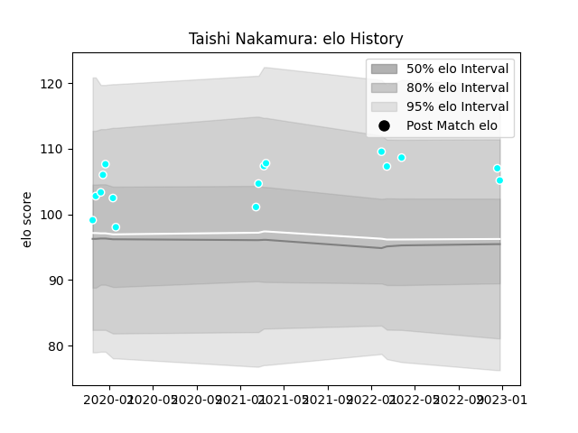

---  
layout: page  
title: Taishi Nakamura  
date: 2023-01-17 11:44:53.633389  
categories: player  
---
# Taishi Nakamura

## Positions: L

## Current elo: 96.0

## Current Percentile: 66.0

# Elo History

# Match History

| Team                             |   Appearances |   Win Rate |
|:---------------------------------|--------------:|-----------:|
| Toyota Industries Shuttles Aichi |            17 |   0.823529 |

| Opponent                 |   Matches |   Win Rate |
|:-------------------------|----------:|-----------:|
| Kyuden Voltex            |         4 |        1   |
| Chugoku Red Regulions    |         2 |        1   |
| Coca-Cola Red Sparks     |         2 |        0.5 |
| Shimizu Blue Sharks      |         2 |        1   |
| Hanazono Kintetsu Liners |         1 |        0   |
| Hino Red Dolphins        |         1 |        1   |
| Kamaishi Seawaves        |         1 |        1   |
| Kurita Water Gush        |         1 |        1   |
| Mazda Blue Zoomers       |         1 |        1   |
| Skyactivs Hiroshima      |         1 |        1   |
| Urayasu D-Rocks          |         1 |        0   |