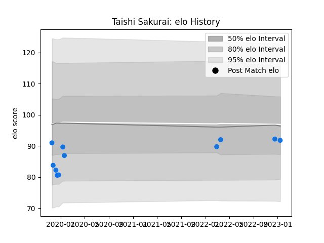

---  
layout: page  
title: Taishi Sakurai  
date: 2023-03-21 18:19:11.067499  
categories: player  
---
# Taishi Sakurai

Last updated: 2023-03-21
## Positions: SH

## Current elo: 73.0

## Current Percentile: 8.0

# Elo History

# Match History

| Team                |   Appearances |   Win Rate |
|:--------------------|--------------:|-----------:|
| Shimizu Blue Sharks |            17 |   0.176471 |

| Opponent                         |   Matches |   Win Rate |
|:---------------------------------|----------:|-----------:|
| Kamaishi Seawaves                |         3 |   0.333333 |
| Chugoku Red Regulions            |         2 |   1        |
| Coca-Cola Red Sparks             |         2 |   0        |
| Hanazono Kintetsu Liners         |         2 |   0        |
| Kurita Water Gush                |         2 |   0        |
| Mie Honda Heat                   |         2 |   0        |
| Toyota Industries Shuttles Aichi |         2 |   0        |
| Kyuden Voltex                    |         1 |   0        |
| Mazda Blue Zoomers               |         1 |   0        |