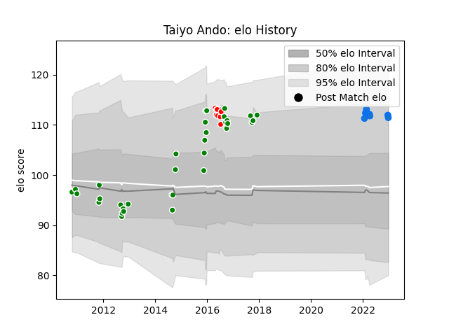

---  
layout: page  
title: Taiyo Ando  
date: 2022-12-31 16:25:57.563277  
categories: player  
---
# Taiyo Ando

## Positions: FL, N8

## Country: Japan

## Current elo: 111.0

## Current Percentile: 87.0

# Elo History

# Match History

| Team                |   Appearances |   Win Rate |
|:--------------------|--------------:|-----------:|
| Toyota Verblitz     |            34 |   0.647059 |
| Shimizu Blue Sharks |             8 |   0.25     |
| Sunwolves           |             8 |   0.1875   |
| Japan               |             1 |   1        |

| Opponent                          |   Matches |   Win Rate |
|:----------------------------------|----------:|-----------:|
| Toyota Industries Shuttles Aichi  |         5 |   0.4      |
| Kobelco Kobe Steelers             |         4 |   0.5      |
| Munakata Sanix Blues              |         3 |   0.666667 |
| Toshiba Brave Lupus Tokyo         |         3 |   0.666667 |
| Kyuden Voltex                     |         3 |   0.666667 |
| Yokohama Canon Eagles             |         3 |   0.666667 |
| Green Rockets Tokatsu             |         3 |   0.333333 |
| Black Rams Tokyo                  |         2 |   1        |
| Shizuoka Blue Revs                |         2 |   0        |
| Kubota Spears Funabashi Tokyo-Bay |         2 |   1        |
| Coca-Cola Red Sparks              |         2 |   1        |
| Urayasu D-Rocks                   |         2 |   0        |
| NTT Docomo Red Hurricanes Osaka   |         2 |   1        |
| Tokyo Sungoliath                  |         2 |   0        |
| Western Force                     |         1 |   0        |
| Bulls                             |         1 |   0        |
| Canada                            |         1 |   1        |
| Stormers                          |         1 |   0.5      |
| Hanazono Kintetsu Liners          |         1 |   1        |
| Sharks                            |         1 |   0        |
| Saitama Wild Knights              |         1 |   0        |
| Jaguares                          |         1 |   1        |
| New South Wales Waratahs          |         1 |   0        |
| Brumbies                          |         1 |   0        |
| Mie Honda Heat                    |         1 |   1        |
| Kurita Water Gush                 |         1 |   1        |
| Queensland Reds                   |         1 |   0        |