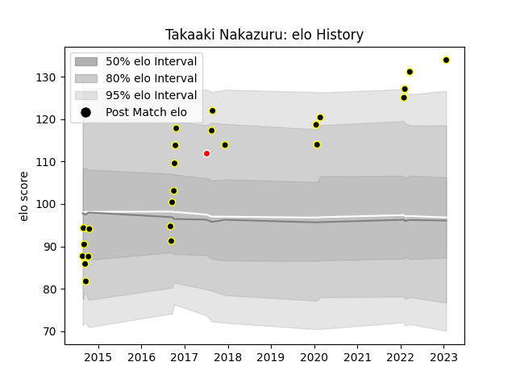

---  
layout: page  
title: Takaaki Nakazuru  
date: 2023-01-25 18:57:40.480232  
categories: player  
---
# Takaaki Nakazuru

## Positions: W

## Current elo: 134.0

## Current Percentile: 96.0

# Elo History

# Match History

| Team             |   Appearances |   Win Rate |
|:-----------------|--------------:|-----------:|
| Tokyo Sungoliath |            24 |   0.916667 |
| Sunwolves        |             1 |   0        |

| Opponent                         |   Matches |   Win Rate |
|:---------------------------------|----------:|-----------:|
| Black Rams Tokyo                 |         4 |          1 |
| Yokohama Canon Eagles            |         3 |          1 |
| Green Rockets Tokatsu            |         2 |          1 |
| Hanazono Kintetsu Liners         |         2 |          1 |
| Kobelco Kobe Steelers            |         2 |          0 |
| NTT Docomo Red Hurricanes Osaka  |         2 |          1 |
| Urayasu D-Rocks                  |         2 |          1 |
| Coca-Cola Red Sparks             |         1 |          1 |
| Hino Red Dolphins                |         1 |          1 |
| Lions                            |         1 |          0 |
| Mie Honda Heat                   |         1 |          1 |
| Munakata Sanix Blues             |         1 |          1 |
| Saitama Wild Knights             |         1 |          1 |
| Toyota Industries Shuttles Aichi |         1 |          1 |
| Toyota Verblitz                  |         1 |          1 |