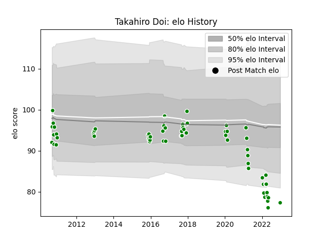

---  
layout: page  
title: Takahiro Doi  
date: 2022-12-28 12:54:32.009388  
categories: player  
---
# Takahiro Doi

## Positions: P

## Current elo: 77.0

## Current Percentile: 2.0

# Elo History

# Match History

| Team                  |   Appearances |   Win Rate |
|:----------------------|--------------:|-----------:|
| Green Rockets Tokatsu |            62 |   0.290323 |

| Opponent                          |   Matches |   Win Rate |
|:----------------------------------|----------:|-----------:|
| Yokohama Canon Eagles             |         6 |   0.333333 |
| Kobelco Kobe Steelers             |         6 |   0        |
| Shizuoka Blue Revs                |         5 |   0        |
| Tokyo Sungoliath                  |         5 |   0.2      |
| Black Rams Tokyo                  |         5 |   0.2      |
| Kubota Spears Funabashi Tokyo-Bay |         5 |   0.5      |
| Saitama Wild Knights              |         4 |   0        |
| Toyota Industries Shuttles Aichi  |         4 |   0.75     |
| Toyota Verblitz                   |         4 |   0.25     |
| Munakata Sanix Blues              |         3 |   0.666667 |
| Coca-Cola Red Sparks              |         3 |   1        |
| Urayasu D-Rocks                   |         3 |   0.333333 |
| NTT Docomo Red Hurricanes Osaka   |         3 |   0.166667 |
| Hino Red Dolphins                 |         2 |   0        |
| Toshiba Brave Lupus Tokyo         |         2 |   0        |
| Kyuden Voltex                     |         1 |   1        |
| Mitsubishi Dynaboars              |         1 |   0        |