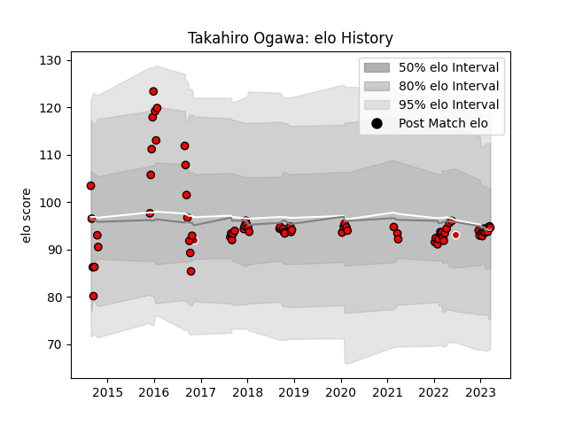

---  
layout: page  
title: Takahiro Ogawa  
date: 2023-03-17 17:02:30.889547  
categories: player  
---
# Takahiro Ogawa

## Positions: SH

## Country: Japan

## Current elo: 95.0

## Current Percentile: 50.0

# Elo History

# Match History

| Team                      |   Appearances |   Win Rate |
|:--------------------------|--------------:|-----------:|
| Toshiba Brave Lupus Tokyo |            74 |   0.533784 |
| Japan                     |             2 |   0.5      |

| Opponent                          |   Matches |   Win Rate |
|:----------------------------------|----------:|-----------:|
| Tokyo Sungoliath                  |         8 |   0.375    |
| Saitama Wild Knights              |         8 |   0.1875   |
| Green Rockets Tokatsu             |         7 |   0.857143 |
| Shizuoka Blue Revs                |         7 |   0.571429 |
| Kubota Spears Funabashi Tokyo-Bay |         6 |   0.333333 |
| Toyota Verblitz                   |         6 |   0.5      |
| Kobelco Kobe Steelers             |         5 |   0.4      |
| Yokohama Canon Eagles             |         4 |   0.75     |
| Urayasu D-Rocks                   |         4 |   0.25     |
| Mie Honda Heat                    |         4 |   0.75     |
| Black Rams Tokyo                  |         4 |   0.75     |
| Hanazono Kintetsu Liners          |         3 |   1        |
| Toyota Industries Shuttles Aichi  |         2 |   0.5      |
| Munakata Sanix Blues              |         2 |   0.5      |
| Mitsubishi Dynaboars              |         2 |   0.5      |
| NTT Docomo Red Hurricanes Osaka   |         1 |   1        |
| Hino Red Dolphins                 |         1 |   1        |
| Uruguay                           |         1 |   1        |
| Argentina                         |         1 |   0        |