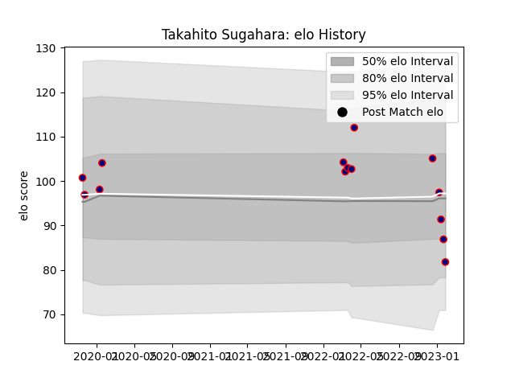

---  
layout: page  
title: Takahito Sugahara  
date: 2023-03-21 18:00:34.840515  
categories: player  
---
# Takahito Sugahara

Last updated: 2023-03-21
## Positions: FL, L

## Current elo: 75.0

## Current Percentile: 11.0

# Elo History

# Match History

| Team                     |   Appearances |   Win Rate |
|:-------------------------|--------------:|-----------:|
| Hanazono Kintetsu Liners |            19 |   0.421053 |

| Opponent                          |   Matches |   Win Rate |
|:----------------------------------|----------:|-----------:|
| Kamaishi Seawaves                 |         2 |          1 |
| Mitsubishi Dynaboars              |         2 |          0 |
| Tokyo Sungoliath                  |         2 |          0 |
| Black Rams Tokyo                  |         1 |          0 |
| Hino Red Dolphins                 |         1 |          1 |
| Kubota Spears Funabashi Tokyo-Bay |         1 |          0 |
| Kurita Water Gush                 |         1 |          1 |
| Mie Honda Heat                    |         1 |          1 |
| Saitama Wild Knights              |         1 |          0 |
| Shimizu Blue Sharks               |         1 |          1 |
| Shizuoka Blue Revs                |         1 |          0 |
| Skyactivs Hiroshima               |         1 |          1 |
| Toshiba Brave Lupus Tokyo         |         1 |          0 |
| Toyota Industries Shuttles Aichi  |         1 |          1 |
| Toyota Verblitz                   |         1 |          0 |
| Yokohama Canon Eagles             |         1 |          0 |