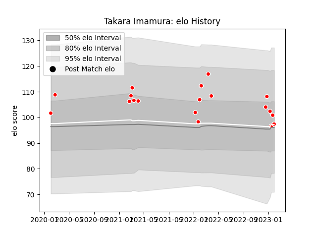

---  
layout: page  
title: Takara Imamura  
date: 2022-12-28 12:57:33.199448  
categories: player  
---
# Takara Imamura

## Positions: FL, L

## Current elo: 120.0

## Current Percentile: 93.0

# Elo History

# Match History

| Team                  |   Appearances |   Win Rate |
|:----------------------|--------------:|-----------:|
| Kobelco Kobe Steelers |            15 |        0.7 |

| Opponent                          |   Matches |   Win Rate |
|:----------------------------------|----------:|-----------:|
| Black Rams Tokyo                  |         2 |       1    |
| Green Rockets Tokatsu             |         2 |       1    |
| Saitama Wild Knights              |         2 |       0.25 |
| Toshiba Brave Lupus Tokyo         |         2 |       0.5  |
| Yokohama Canon Eagles             |         2 |       0.5  |
| Hanazono Kintetsu Liners          |         1 |       1    |
| Hino Red Dolphins                 |         1 |       1    |
| Kubota Spears Funabashi Tokyo-Bay |         1 |       1    |
| NTT Docomo Red Hurricanes Osaka   |         1 |       1    |
| Urayasu D-Rocks                   |         1 |       0    |