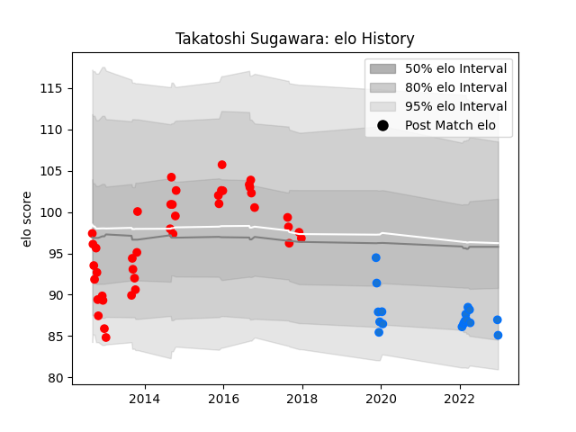

---  
layout: page  
title: Takatoshi Sugawara  
date: 2022-12-28 12:56:49.435474  
categories: player  
---
# Takatoshi Sugawara

## Positions: P

## Current elo: 85.0

## Current Percentile: 13.0

# Elo History

# Match History

| Team                  |   Appearances |   Win Rate |
|:----------------------|--------------:|-----------:|
| Yokohama Canon Eagles |            41 |   0.390244 |
| Shimizu Blue Sharks   |            18 |   0.277778 |

| Opponent                          |   Matches |   Win Rate |
|:----------------------------------|----------:|-----------:|
| Toyota Industries Shuttles Aichi  |         6 |   0.333333 |
| Black Rams Tokyo                  |         5 |   0.2      |
| Coca-Cola Red Sparks              |         4 |   0.75     |
| Toyota Verblitz                   |         4 |   0.25     |
| Kobelco Kobe Steelers             |         4 |   0        |
| Kyuden Voltex                     |         4 |   0.5      |
| Shizuoka Blue Revs                |         4 |   0.25     |
| Saitama Wild Knights              |         3 |   0.333333 |
| Hanazono Kintetsu Liners          |         3 |   0.666667 |
| Toshiba Brave Lupus Tokyo         |         3 |   0        |
| Tokyo Sungoliath                  |         3 |   0        |
| Munakata Sanix Blues              |         3 |   0.666667 |
| NTT Docomo Red Hurricanes Osaka   |         3 |   1        |
| Urayasu D-Rocks                   |         2 |   0        |
| Chugoku Red Regulions             |         2 |   1        |
| Kurita Water Gush                 |         2 |   0.5      |
| Kubota Spears Funabashi Tokyo-Bay |         1 |   0        |
| Kamaishi Seawaves                 |         1 |   0        |
| Green Rockets Tokatsu             |         1 |   0        |
| Mazda Blue Zoomers                |         1 |   0        |