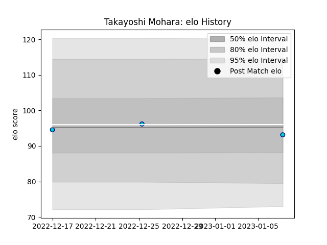

---  
layout: page  
title: Takayoshi Mohara  
date: 2023-03-17 17:11:19.339572  
categories: player  
---
# Takayoshi Mohara

## Positions: P

## Current elo: 89.0

## Current Percentile: 29.0

# Elo History

# Match History

| Team               |   Appearances |   Win Rate |
|:-------------------|--------------:|-----------:|
| Shizuoka Blue Revs |             6 |          0 |

| Opponent                          |   Matches |   Win Rate |
|:----------------------------------|----------:|-----------:|
| Black Rams Tokyo                  |         1 |          0 |
| Kobelco Kobe Steelers             |         1 |          0 |
| Kubota Spears Funabashi Tokyo-Bay |         1 |          0 |
| Saitama Wild Knights              |         1 |          0 |
| Toshiba Brave Lupus Tokyo         |         1 |          0 |
| Toyota Verblitz                   |         1 |          0 |