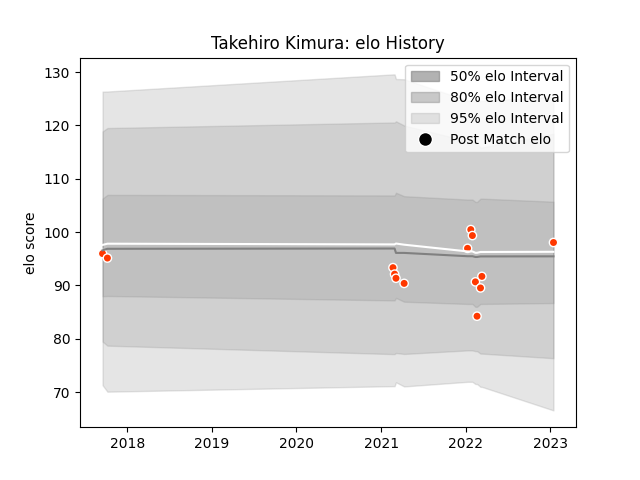

---  
layout: page  
title: Takehiro Kimura  
date: 2023-01-15 11:50:17.334920  
categories: player  
---
# Takehiro Kimura

## Positions: L

## Current elo: 98.0

## Current Percentile: 38.0

# Elo History

# Match History

| Team              |   Appearances |   Win Rate |
|:------------------|--------------:|-----------:|
| Hino Red Dolphins |            14 |   0.357143 |

| Opponent                 |   Matches |   Win Rate |
|:-------------------------|----------:|-----------:|
| Kamaishi Seawaves        |         3 |          1 |
| Mie Honda Heat           |         3 |          0 |
| Black Rams Tokyo         |         1 |          0 |
| Chubu Electric Power     |         1 |          1 |
| Hanazono Kintetsu Liners |         1 |          0 |
| Kobelco Kobe Steelers    |         1 |          0 |
| Mitsubishi Dynaboars     |         1 |          0 |
| Saitama Wild Knights     |         1 |          0 |
| Shizuoka Blue Revs       |         1 |          0 |
| Skyactivs Hiroshima      |         1 |          1 |