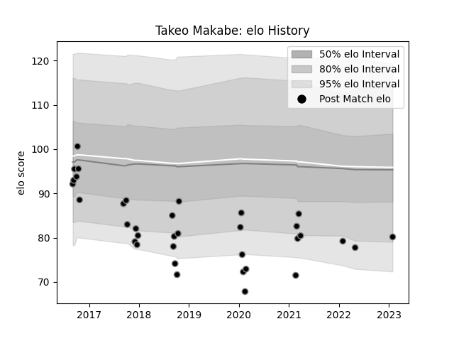

---  
layout: page  
title: Takeo Makabe  
date: 2023-01-30 17:53:56.584856  
categories: player  
---
# Takeo Makabe

## Positions: P

## Current elo: 80.0

## Current Percentile: None

# Elo History

# Match History

| Team             |   Appearances |   Win Rate |
|:-----------------|--------------:|-----------:|
| Black Rams Tokyo |            35 |        0.4 |

| Opponent                          |   Matches |   Win Rate |
|:----------------------------------|----------:|-----------:|
| Shizuoka Blue Revs                |         5 |   0.2      |
| Yokohama Canon Eagles             |         4 |   0.75     |
| Kobelco Kobe Steelers             |         3 |   0        |
| Saitama Wild Knights              |         3 |   0.333333 |
| Green Rockets Tokatsu             |         2 |   1        |
| Kubota Spears Funabashi Tokyo-Bay |         2 |   0        |
| Mie Honda Heat                    |         2 |   0.5      |
| NTT Docomo Red Hurricanes Osaka   |         2 |   0.5      |
| Tokyo Sungoliath                  |         2 |   0        |
| Toshiba Brave Lupus Tokyo         |         2 |   0.5      |
| Toyota Verblitz                   |         2 |   0        |
| Urayasu D-Rocks                   |         2 |   0        |
| Coca-Cola Red Sparks              |         1 |   1        |
| Hanazono Kintetsu Liners          |         1 |   1        |
| Munakata Sanix Blues              |         1 |   1        |
| Toyota Industries Shuttles Aichi  |         1 |   1        |