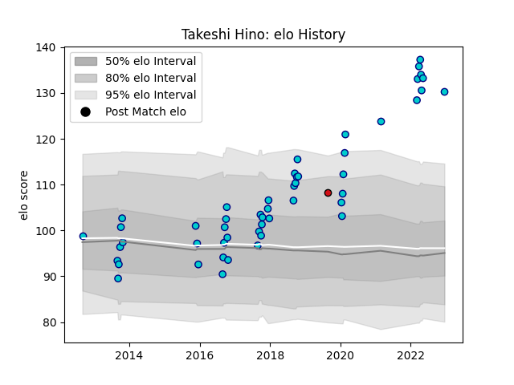

---  
layout: page  
title: Takeshi Hino  
date: 2023-03-16 19:52:13.245457  
categories: player  
---
# Takeshi Hino

## Positions: H

## Country: Japan

## Current elo: 97.0

## Current Percentile: 61.0

# Elo History

# Match History

| Team               |   Appearances |   Win Rate |
|:-------------------|--------------:|-----------:|
| Shizuoka Blue Revs |            74 |   0.743243 |
| Sunwolves          |             8 |   0.125    |
| Japan              |             4 |   0.5      |
| Stade Toulousain   |             3 |   0.666667 |

| Opponent                          |   Matches |   Win Rate |
|:----------------------------------|----------:|-----------:|
| Black Rams Tokyo                  |         7 |   1        |
| Toyota Verblitz                   |         7 |   0.857143 |
| Kubota Spears Funabashi Tokyo-Bay |         6 |   0.75     |
| Toshiba Brave Lupus Tokyo         |         6 |   0.666667 |
| Saitama Wild Knights              |         6 |   0.25     |
| Yokohama Canon Eagles             |         6 |   0.666667 |
| Urayasu D-Rocks                   |         5 |   0.8      |
| Coca-Cola Red Sparks              |         4 |   1        |
| Tokyo Sungoliath                  |         4 |   0        |
| Kobelco Kobe Steelers             |         4 |   0.25     |
| Green Rockets Tokatsu             |         4 |   1        |
| Toyota Industries Shuttles Aichi  |         3 |   1        |
| Munakata Sanix Blues              |         3 |   1        |
| NTT Docomo Red Hurricanes Osaka   |         3 |   1        |
| Hino Red Dolphins                 |         2 |   1        |
| Mie Honda Heat                    |         2 |   1        |
| Georgia                           |         1 |   1        |
| Cheetahs                          |         1 |   0        |
| Southern Kings                    |         1 |   0        |
| Bordeaux Begles                   |         1 |   0        |
| Uruguay                           |         1 |   1        |
| Wales                             |         1 |   0        |
| Stormers                          |         1 |   0        |
| Pau                               |         1 |   1        |
| Sharks                            |         1 |   0        |
| Racing 92                         |         1 |   1        |
| Blues                             |         1 |   1        |
| Lions                             |         1 |   0        |
| Fiji                              |         1 |   0        |
| Jaguares                          |         1 |   0        |
| Hurricanes                        |         1 |   0        |
| Hanazono Kintetsu Liners          |         1 |   1        |
| Mitsubishi Dynaboars              |         1 |   1        |