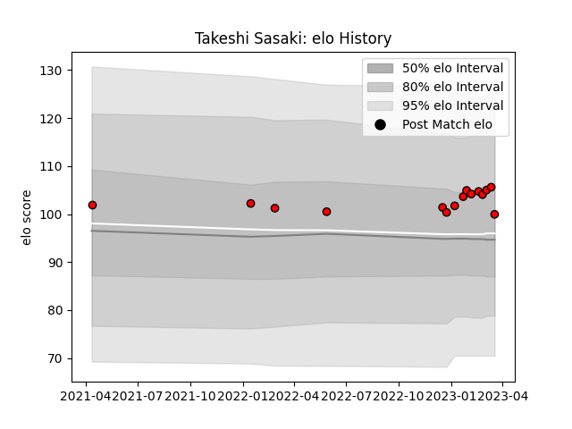

---  
layout: page  
title: Takeshi Sasaki  
date: 2023-03-21 18:20:58.203236  
categories: player  
---
# Takeshi Sasaki

Last updated: 2023-03-21
## Positions: FL

## Current elo: 100.0

## Current Percentile: 74.0

# Elo History

# Match History

| Team                      |   Appearances |   Win Rate |
|:--------------------------|--------------:|-----------:|
| Toshiba Brave Lupus Tokyo |            15 |        0.6 |

| Opponent                          |   Matches |   Win Rate |
|:----------------------------------|----------:|-----------:|
| Kubota Spears Funabashi Tokyo-Bay |         2 |          0 |
| Toyota Verblitz                   |         2 |          1 |
| Black Rams Tokyo                  |         1 |          1 |
| Green Rockets Tokatsu             |         1 |          1 |
| Hanazono Kintetsu Liners          |         1 |          1 |
| Kobelco Kobe Steelers             |         1 |          1 |
| Munakata Sanix Blues              |         1 |          1 |
| NTT Docomo Red Hurricanes Osaka   |         1 |          1 |
| Saitama Wild Knights              |         1 |          0 |
| Shizuoka Blue Revs                |         1 |          1 |
| Tokyo Sungoliath                  |         1 |          0 |
| Urayasu D-Rocks                   |         1 |          0 |
| Yokohama Canon Eagles             |         1 |          0 |