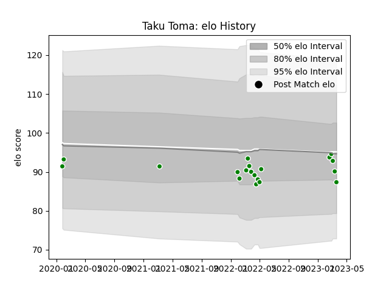

---  
layout: page  
title: Taku Toma  
date: 2023-03-21 18:08:45.274645  
categories: player  
---
# Taku Toma

Last updated: 2023-03-21
## Positions: P

## Current elo: 87.0

## Current Percentile: 31.0

# Elo History

# Match History

| Team                  |   Appearances |   Win Rate |
|:----------------------|--------------:|-----------:|
| Green Rockets Tokatsu |            19 |  0.0526316 |

| Opponent                          |   Matches |   Win Rate |
|:----------------------------------|----------:|-----------:|
| Kobelco Kobe Steelers             |         3 |          0 |
| Black Rams Tokyo                  |         2 |          0 |
| Kubota Spears Funabashi Tokyo-Bay |         2 |          0 |
| Toshiba Brave Lupus Tokyo         |         2 |          0 |
| Toyota Verblitz                   |         2 |          0 |
| Yokohama Canon Eagles             |         2 |          0 |
| Mitsubishi Dynaboars              |         1 |          1 |
| NTT Docomo Red Hurricanes Osaka   |         1 |          0 |
| Saitama Wild Knights              |         1 |          0 |
| Shizuoka Blue Revs                |         1 |          0 |
| Tokyo Sungoliath                  |         1 |          0 |
| Urayasu D-Rocks                   |         1 |          0 |