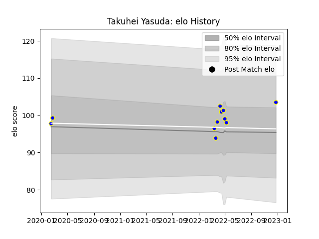

---  
layout: page  
title: Takuhei Yasuda  
date: 2023-03-21 18:44:41.848721  
categories: player  
---
# Takuhei Yasuda

Last updated: 2023-03-21
## Positions: FB, W

## Current elo: 140.0

## Current Percentile: 97.0

# Elo History

# Match History

| Team            |   Appearances |   Win Rate |
|:----------------|--------------:|-----------:|
| Urayasu D-Rocks |            20 |       0.55 |

| Opponent                          |   Matches |   Win Rate |
|:----------------------------------|----------:|-----------:|
| Kamaishi Seawaves                 |         2 |          1 |
| Mitsubishi Dynaboars              |         2 |          0 |
| Shimizu Blue Sharks               |         2 |          1 |
| Toyota Industries Shuttles Aichi  |         2 |          1 |
| Black Rams Tokyo                  |         1 |          1 |
| Green Rockets Tokatsu             |         1 |          1 |
| Hino Red Dolphins                 |         1 |          1 |
| Kobelco Kobe Steelers             |         1 |          0 |
| Kubota Spears Funabashi Tokyo-Bay |         1 |          0 |
| Mie Honda Heat                    |         1 |          1 |
| Munakata Sanix Blues              |         1 |          1 |
| Saitama Wild Knights              |         1 |          0 |
| Shizuoka Blue Revs                |         1 |          0 |
| Tokyo Sungoliath                  |         1 |          0 |
| Toyota Verblitz                   |         1 |          0 |
| Yokohama Canon Eagles             |         1 |          0 |