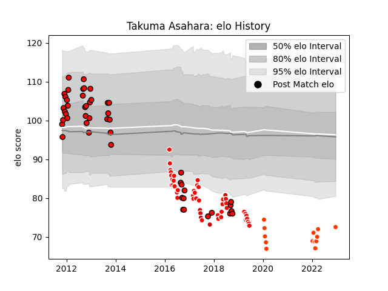

---  
layout: page  
title: Takuma Asahara  
date: 2022-12-18 16:24:00.949789  
categories: player  
---
# Takuma Asahara

## Positions: P

## Country: Japan

## Current elo: 73.0

## Current Percentile: 1.0

# Elo History

# Match History

| Team                      |   Appearances |   Win Rate |
|:--------------------------|--------------:|-----------:|
| Toshiba Brave Lupus Tokyo |            48 |   0.708333 |
| Sunwolves                 |            42 |   0.130952 |
| Hino Red Dolphins         |            13 |   0.307692 |
| Japan                     |             7 |   0.428571 |

| Opponent                          |   Matches |   Win Rate |
|:----------------------------------|----------:|-----------:|
| Shizuoka Blue Revs                |         7 |   0.428571 |
| Stormers                          |         6 |   0.25     |
| Black Rams Tokyo                  |         5 |   0.6      |
| Hanazono Kintetsu Liners          |         5 |   0.6      |
| Queensland Reds                   |         4 |   0.25     |
| Saitama Wild Knights              |         4 |   0.5      |
| Green Rockets Tokatsu             |         4 |   0.75     |
| Yokohama Canon Eagles             |         4 |   0.75     |
| Coca-Cola Red Sparks              |         4 |   1        |
| Cheetahs                          |         4 |   0        |
| Kubota Spears Funabashi Tokyo-Bay |         3 |   0.666667 |
| Tokyo Sungoliath                  |         3 |   0.333333 |
| Toyota Verblitz                   |         3 |   0.333333 |
| New South Wales Waratahs          |         3 |   0.333333 |
| Munakata Sanix Blues              |         3 |   0.666667 |
| Mie Honda Heat                    |         3 |   0.666667 |
| Sharks                            |         3 |   0        |
| Melbourne Rebels                  |         3 |   0        |
| Bulls                             |         3 |   0.333333 |
| Jaguares                          |         3 |   0.333333 |
| Hurricanes                        |         3 |   0        |
| Brumbies                          |         3 |   0        |
| Kobelco Kobe Steelers             |         2 |   0.5      |
| Kamaishi Seawaves                 |         2 |   1        |
| Mitsubishi Dynaboars              |         2 |   0        |
| Italy                             |         2 |   0.5      |
| NTT Docomo Red Hurricanes Osaka   |         2 |   1        |
| Ireland                           |         2 |   0        |
| Urayasu D-Rocks                   |         2 |   1        |
| Crusaders                         |         2 |   0        |
| Southern Kings                    |         2 |   0        |
| Western Force                     |         1 |   0        |
| Toyota Industries Shuttles Aichi  |         1 |   0        |
| Georgia                           |         1 |   1        |
| Chiefs                            |         1 |   0        |
| Skyactivs Hiroshima               |         1 |   1        |
| Kyuden Voltex                     |         1 |   1        |
| Highlanders                       |         1 |   0        |
| Romania                           |         1 |   1        |
| Australia                         |         1 |   0        |