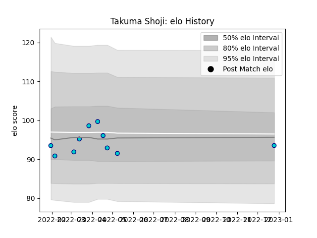

---  
layout: page  
title: Takuma Shoji  
date: 2023-03-04 11:39:52.055661  
categories: player  
---
# Takuma Shoji

## Positions: FL

## Current elo: 92.0

## Current Percentile: 40.0

# Elo History

# Match History

| Team               |   Appearances |   Win Rate |
|:-------------------|--------------:|-----------:|
| Shizuoka Blue Revs |            12 |   0.291667 |

| Opponent                          |   Matches |   Win Rate |
|:----------------------------------|----------:|-----------:|
| Kubota Spears Funabashi Tokyo-Bay |         2 |        0   |
| Saitama Wild Knights              |         2 |        0   |
| Toshiba Brave Lupus Tokyo         |         2 |        0   |
| Black Rams Tokyo                  |         1 |        1   |
| NTT Docomo Red Hurricanes Osaka   |         1 |        1   |
| Tokyo Sungoliath                  |         1 |        0   |
| Toyota Verblitz                   |         1 |        0   |
| Urayasu D-Rocks                   |         1 |        1   |
| Yokohama Canon Eagles             |         1 |        0.5 |