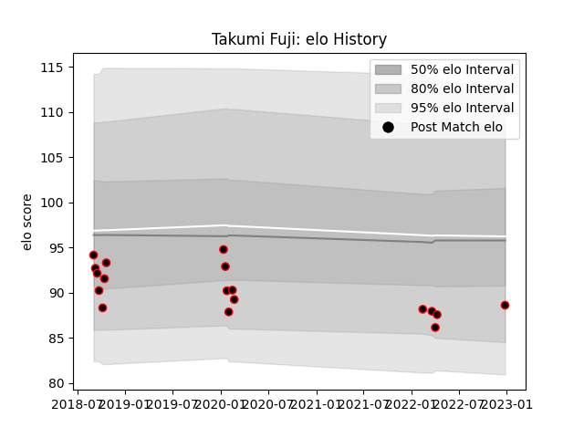

---  
layout: page  
title: Takumi Fuji  
date: 2022-12-28 12:57:52.459459  
categories: player  
---
# Takumi Fuji

## Positions: P

## Current elo: 89.0

## Current Percentile: None

# Elo History

# Match History

| Team           |   Appearances |   Win Rate |
|:---------------|--------------:|-----------:|
| Mie Honda Heat |            18 |   0.416667 |

| Opponent                          |   Matches |   Win Rate |
|:----------------------------------|----------:|-----------:|
| Black Rams Tokyo                  |         2 |       0.5  |
| Kamaishi Seawaves                 |         2 |       1    |
| Kubota Spears Funabashi Tokyo-Bay |         2 |       0    |
| Mitsubishi Dynaboars              |         2 |       0.5  |
| Toshiba Brave Lupus Tokyo         |         2 |       0.5  |
| Yokohama Canon Eagles             |         2 |       0.75 |
| Coca-Cola Red Sparks              |         1 |       1    |
| Hanazono Kintetsu Liners          |         1 |       0    |
| Saitama Wild Knights              |         1 |       0    |
| Shizuoka Blue Revs                |         1 |       0    |
| Toyota Verblitz                   |         1 |       0    |
| Urayasu D-Rocks                   |         1 |       0    |