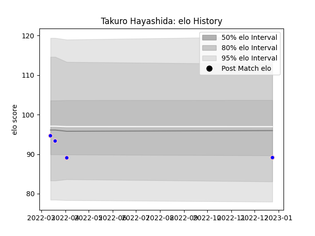

---  
layout: page  
title: Takuro Hayashida  
date: 2023-02-02 18:50:04.088315  
categories: player  
---
# Takuro Hayashida

## Positions: FH, C

## Current elo: 85.0

## Current Percentile: 9.0

# Elo History

# Match History

| Team              |   Appearances |   Win Rate |
|:------------------|--------------:|-----------:|
| Kurita Water Gush |             7 |   0.285714 |

| Opponent                         |   Matches |   Win Rate |
|:---------------------------------|----------:|-----------:|
| Chugoku Red Regulions            |         2 |          0 |
| Kyuden Voltex                    |         1 |          0 |
| Munakata Sanix Blues             |         1 |          0 |
| NTT Docomo Red Hurricanes Osaka  |         1 |          1 |
| Skyactivs Hiroshima              |         1 |          1 |
| Toyota Industries Shuttles Aichi |         1 |          0 |