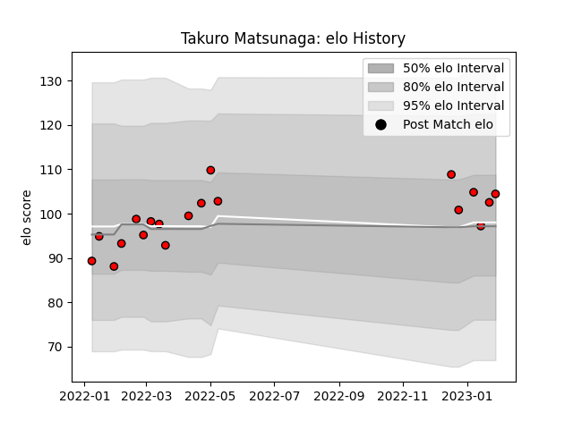

---  
layout: page  
title: Takuro Matsunaga  
date: 2023-02-02 19:11:35.669602  
categories: player  
---
# Takuro Matsunaga

## Positions: FB

## Current elo: 104.0

## Current Percentile: 62.0

# Elo History

# Match History

| Team                      |   Appearances |   Win Rate |
|:--------------------------|--------------:|-----------:|
| Toshiba Brave Lupus Tokyo |            19 |   0.631579 |

| Opponent                          |   Matches |   Win Rate |
|:----------------------------------|----------:|-----------:|
| Shizuoka Blue Revs                |         3 |   1        |
| Toyota Verblitz                   |         3 |   0.666667 |
| NTT Docomo Red Hurricanes Osaka   |         2 |   1        |
| Saitama Wild Knights              |         2 |   0        |
| Tokyo Sungoliath                  |         2 |   0.5      |
| Black Rams Tokyo                  |         1 |   1        |
| Green Rockets Tokatsu             |         1 |   1        |
| Hanazono Kintetsu Liners          |         1 |   1        |
| Kubota Spears Funabashi Tokyo-Bay |         1 |   0        |
| Mitsubishi Dynaboars              |         1 |   0        |
| Urayasu D-Rocks                   |         1 |   0        |
| Yokohama Canon Eagles             |         1 |   1        |