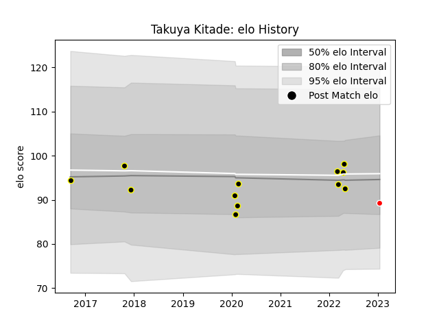

---  
layout: page  
title: Takuya Kitade  
date: 2023-01-17 11:35:34.356489  
categories: player  
---
# Takuya Kitade

## Positions: H

## Current elo: 89.0

## Current Percentile: 42.0

# Elo History

# Match History

| Team                  |   Appearances |   Win Rate |
|:----------------------|--------------:|-----------:|
| Tokyo Sungoliath      |            12 |       0.75 |
| Kobelco Kobe Steelers |             1 |       0    |

| Opponent                          |   Matches |   Win Rate |
|:----------------------------------|----------:|-----------:|
| Black Rams Tokyo                  |         2 |        1   |
| Green Rockets Tokatsu             |         2 |        1   |
| Kobelco Kobe Steelers             |         2 |        0.5 |
| Hino Red Dolphins                 |         1 |        1   |
| Kubota Spears Funabashi Tokyo-Bay |         1 |        1   |
| Saitama Wild Knights              |         1 |        0   |
| Shizuoka Blue Revs                |         1 |        1   |
| Tokyo Sungoliath                  |         1 |        0   |
| Toshiba Brave Lupus Tokyo         |         1 |        0   |
| Toyota Verblitz                   |         1 |        1   |