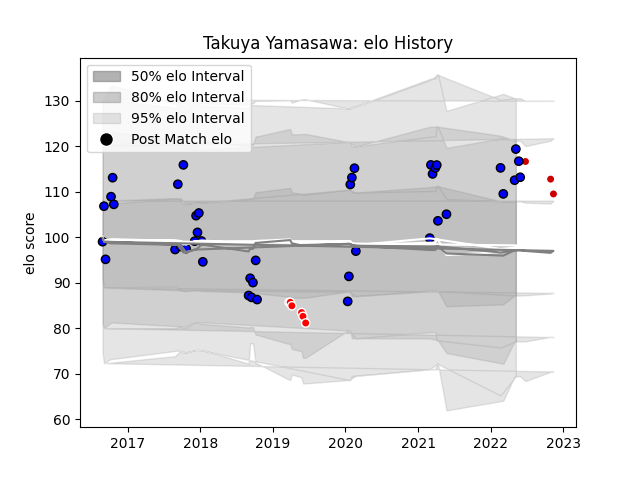

---  
layout: page  
title: Takuya Yamasawa  
date: 2023-03-16 20:16:36.844978  
categories: player  
---
# Takuya Yamasawa

## Positions: FH

## Country: Japan

## Current elo: 119.0

## Current Percentile: 80.0

# Elo History

# Match History

| Team                 |   Appearances |   Win Rate |
|:---------------------|--------------:|-----------:|
| Saitama Wild Knights |            42 |   0.916667 |
| Sunwolves            |             6 |   0.166667 |
| Japan                |             3 |   0.333333 |

| Opponent                          |   Matches |   Win Rate |
|:----------------------------------|----------:|-----------:|
| Yokohama Canon Eagles             |         4 |       1    |
| Green Rockets Tokatsu             |         4 |       1    |
| Tokyo Sungoliath                  |         4 |       0.75 |
| Shizuoka Blue Revs                |         4 |       0.75 |
| Kubota Spears Funabashi Tokyo-Bay |         4 |       1    |
| Coca-Cola Red Sparks              |         3 |       1    |
| Toyota Verblitz                   |         3 |       1    |
| Toshiba Brave Lupus Tokyo         |         3 |       1    |
| NTT Docomo Red Hurricanes Osaka   |         3 |       1    |
| Melbourne Rebels                  |         2 |       0    |
| Black Rams Tokyo                  |         2 |       0.5  |
| Kobelco Kobe Steelers             |         2 |       0.75 |
| Lions                             |         1 |       0    |
| Brumbies                          |         1 |       0    |
| Mitsubishi Dynaboars              |         1 |       1    |
| Munakata Sanix Blues              |         1 |       1    |
| New South Wales Waratahs          |         1 |       1    |
| New Zealand                       |         1 |       0    |
| Jaguares                          |         1 |       0    |
| Hino Red Dolphins                 |         1 |       1    |
| Hanazono Kintetsu Liners          |         1 |       1    |
| Toyota Industries Shuttles Aichi  |         1 |       1    |
| England                           |         1 |       0    |
| Uruguay                           |         1 |       1    |
| Mie Honda Heat                    |         1 |       1    |