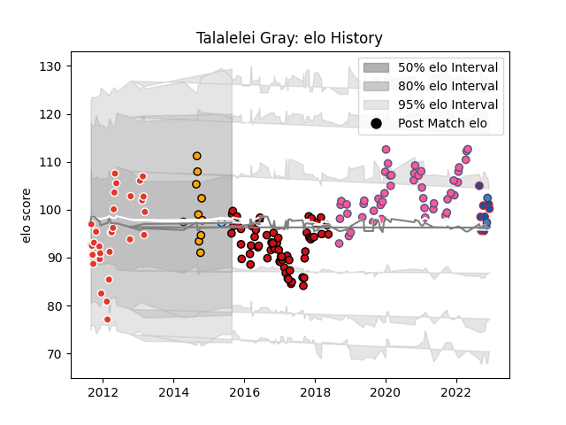

---  
layout: page  
title: Talalelei Gray  
date: 2022-12-09 13:22:31.354037  
categories: player  
---
# Talalelei Gray

## Positions: N8, FL

## Country: Samoa

## Current elo: 96.0

## Current Percentile: 40.0

# Elo History

# Match History

| Team                     |   Appearances |   Win Rate |
|:-------------------------|--------------:|-----------:|
| Stade Toulousain         |            63 |   0.52381  |
| Stade Francais Paris     |            45 |   0.411111 |
| Biarritz Olympique       |            28 |   0.392857 |
| NSW Country Eagles       |             9 |   0.666667 |
| Grenoble                 |             7 |   0.5      |
| Samoa                    |             3 |   0.666667 |
| New South Wales Waratahs |             2 |   0        |

| Opponent             |   Matches |   Win Rate |
|:---------------------|----------:|-----------:|
| Montpellier Herault  |        12 |   0.208333 |
| Racing 92            |        12 |   0.25     |
| Toulon               |        11 |   0.454545 |
| Brive                |        11 |   0.590909 |
| Clermont Auvergne    |        11 |   0.363636 |
| Bordeaux Begles      |        10 |   0.55     |
| La Rochelle          |         8 |   0.375    |
| Castres Olympique    |         8 |   0.5      |
| Pau                  |         7 |   0.714286 |
| Stade Toulousain     |         6 |   0.333333 |
| Oyonnax              |         6 |   0.75     |
| Lyon                 |         6 |   0.583333 |
| Connacht             |         4 |   0.5      |
| Bayonne              |         4 |   0.5      |
| Perpignan            |         3 |   0.333333 |
| Agen                 |         3 |   0.5      |
| Grenoble             |         3 |   0.666667 |
| Harlequins           |         2 |   0        |
| Western Force        |         2 |   0        |
| Wasps                |         2 |   0.25     |
| Stade Francais Paris |         2 |   1        |
| Brisbane City        |         2 |   0        |
| Queensland Country   |         1 |   1        |
| Vannes               |         1 |   0        |
| Benetton Treviso     |         1 |   0        |
| Sydney Stars         |         1 |   1        |
| Beziers              |         1 |   1        |
| Sale Sharks          |         1 |   1        |
| Rouen                |         1 |   1        |
| Romania              |         1 |   1        |
| Biarritz Olympique   |         1 |   0.5      |
| Provence Rugby       |         1 |   0        |
| Italy                |         1 |   0        |
| Perth Spirit         |         1 |   1        |
| Bristol Rugby        |         1 |   0        |
| Canberra Vikings     |         1 |   1        |
| Ospreys              |         1 |   1        |
| North Harbour Rays   |         1 |   1        |
| Munster              |         1 |   0        |
| Georgia              |         1 |   1        |
| Montauban            |         1 |   1        |
| Melbourne Rising     |         1 |   0        |
| Greater Sydney Rams  |         1 |   1        |
| Zebre                |         1 |   1        |