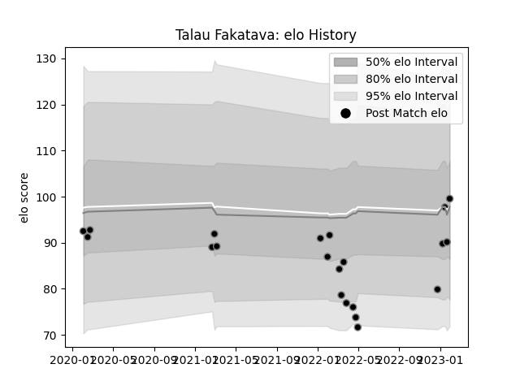

---  
layout: page  
title: Talau Fakatava  
date: 2023-02-02 18:57:57.485754  
categories: player  
---
# Talau Fakatava

## Positions: L, N8

## Current elo: 100.0

## Current Percentile: 33.0

# Elo History

# Match History

| Team             |   Appearances |   Win Rate |
|:-----------------|--------------:|-----------:|
| Black Rams Tokyo |            21 |   0.285714 |

| Opponent                          |   Matches |   Win Rate |
|:----------------------------------|----------:|-----------:|
| Saitama Wild Knights              |         3 |   0        |
| Toyota Verblitz                   |         3 |   0.333333 |
| Green Rockets Tokatsu             |         2 |   1        |
| Kobelco Kobe Steelers             |         2 |   0        |
| NTT Docomo Red Hurricanes Osaka   |         2 |   0.5      |
| Shizuoka Blue Revs                |         2 |   1        |
| Tokyo Sungoliath                  |         2 |   0        |
| Toshiba Brave Lupus Tokyo         |         2 |   0        |
| Urayasu D-Rocks                   |         2 |   0        |
| Kubota Spears Funabashi Tokyo-Bay |         1 |   0        |