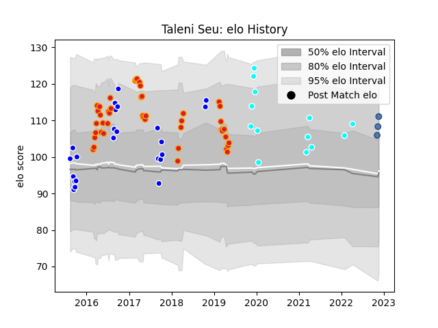

---  
layout: page  
title: Taleni Seu  
date: 2023-03-16 20:03:32.821661  
categories: player  
---
# Taleni Seu

## Positions: FL, N8

## Country: Samoa

## Current elo: 111.0

## Current Percentile: 85.0

# Elo History

# Match History

| Team                             |   Appearances |   Win Rate |
|:---------------------------------|--------------:|-----------:|
| Chiefs                           |            44 |   0.625    |
| Auckland                         |            23 |   0.673913 |
| Toyota Industries Shuttles Aichi |            13 |   0.769231 |
| New South Wales Waratahs         |             3 |   0.333333 |
| Samoa                            |             3 |   0.666667 |

| Opponent                 |   Matches |   Win Rate |
|:-------------------------|----------:|-----------:|
| Hurricanes               |         6 |   0.416667 |
| Highlanders              |         6 |   0.416667 |
| Crusaders                |         5 |   0.4      |
| Blues                    |         5 |   0.9      |
| Brumbies                 |         3 |   0.333333 |
| Canterbury               |         3 |   0.333333 |
| Sunwolves                |         3 |   0.666667 |
| Southland                |         3 |   0.833333 |
| Shimizu Blue Sharks      |         3 |   1        |
| Otago                    |         2 |   1        |
| Melbourne Rebels         |         2 |   0.5      |
| Northland                |         2 |   1        |
| Bay of Plenty            |         2 |   1        |
| Queensland Reds          |         2 |   1        |
| Sharks                   |         2 |   1        |
| Stormers                 |         2 |   0.5      |
| Tasman                   |         2 |   0.5      |
| Lions                    |         2 |   0        |
| Western Force            |         2 |   1        |
| Counties Manukau         |         2 |   0.5      |
| Jaguares                 |         2 |   1        |
| Hawke's Bay              |         2 |   0.5      |
| Hanazono Kintetsu Liners |         2 |   0.5      |
| Coca-Cola Red Sparks     |         2 |   0.5      |
| Kamaishi Seawaves        |         1 |   1        |
| Wellington               |         1 |   1        |
| Waikato                  |         1 |   1        |
| Bulls                    |         1 |   1        |
| Taranaki                 |         1 |   0        |
| Cheetahs                 |         1 |   1        |
| Chugoku Red Regulions    |         1 |   1        |
| Southern Kings           |         1 |   1        |
| Romania                  |         1 |   1        |
| Fijian Drua              |         1 |   1        |
| Kurita Water Gush        |         1 |   1        |
| Georgia                  |         1 |   1        |
| Green Rockets Tokatsu    |         1 |   0        |
| North Harbour            |         1 |   0        |
| New South Wales Waratahs |         1 |   0        |
| Mazda Blue Zoomers       |         1 |   1        |
| Manawatu                 |         1 |   1        |
| Italy                    |         1 |   0        |
| Kyuden Voltex            |         1 |   1        |