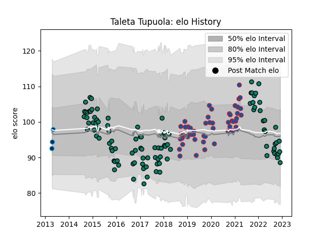

---  
layout: page  
title: Taleta Tupuola  
date: 2022-12-18 16:14:51.618195  
categories: player  
---
# Taleta Tupuola

## Positions: C, W

## Current elo: 91.0

## Current Percentile: 24.0

# Elo History

# Match History

| Team                |   Appearances |   Win Rate |
|:--------------------|--------------:|-----------:|
| Montauban           |           105 |   0.571429 |
| Grenoble            |            53 |   0.481132 |
| Montpellier Herault |             3 |   0.666667 |

| Opponent                   |   Matches |   Win Rate |
|:---------------------------|----------:|-----------:|
| Colomiers                  |        11 |   0.545455 |
| Mont-de-Marsan             |        10 |   0.6      |
| Beziers                    |        10 |   0.6      |
| Narbonne                   |         9 |   0.666667 |
| Aurillac                   |         8 |   0.6875   |
| Biarritz Olympique         |         8 |   0.5      |
| Perpignan                  |         7 |   0.428571 |
| Carcassonne                |         7 |   0.428571 |
| Nevers                     |         7 |   0.714286 |
| Agen                       |         6 |   0.416667 |
| Soyaux-Angouleme           |         6 |   0.833333 |
| Rouen                      |         5 |   0.6      |
| Vannes                     |         5 |   0.7      |
| Bourgoin-Jallieu           |         5 |   0.8      |
| Bayonne                    |         5 |   0.2      |
| Pau                        |         4 |   0        |
| Provence Rugby             |         4 |   0.5      |
| Dax                        |         4 |   0.5      |
| Tarbes                     |         3 |   0.833333 |
| Grenoble                   |         3 |   0.333333 |
| Montauban                  |         3 |   0.5      |
| Massy                      |         3 |   1        |
| Lyon                       |         3 |   0        |
| Clermont Auvergne          |         2 |   0.25     |
| US Bressane                |         2 |   0.75     |
| Toulon                     |         2 |   0.5      |
| Stade Toulousain           |         2 |   0.5      |
| Stade Francais Paris       |         2 |   0.5      |
| Montpellier Herault        |         2 |   0.5      |
| Harlequins                 |         2 |   0.5      |
| Albi                       |         2 |   0.5      |
| Oyonnax                    |         2 |   1        |
| Castres Olympique          |         2 |   0        |
| Benetton Treviso           |         1 |   0        |
| Racing 92                  |         1 |   0        |
| La Rochelle                |         1 |   0        |
| Valence Romans Drome Rugby |         1 |   1        |
| Roval Drome XV             |         1 |   1        |